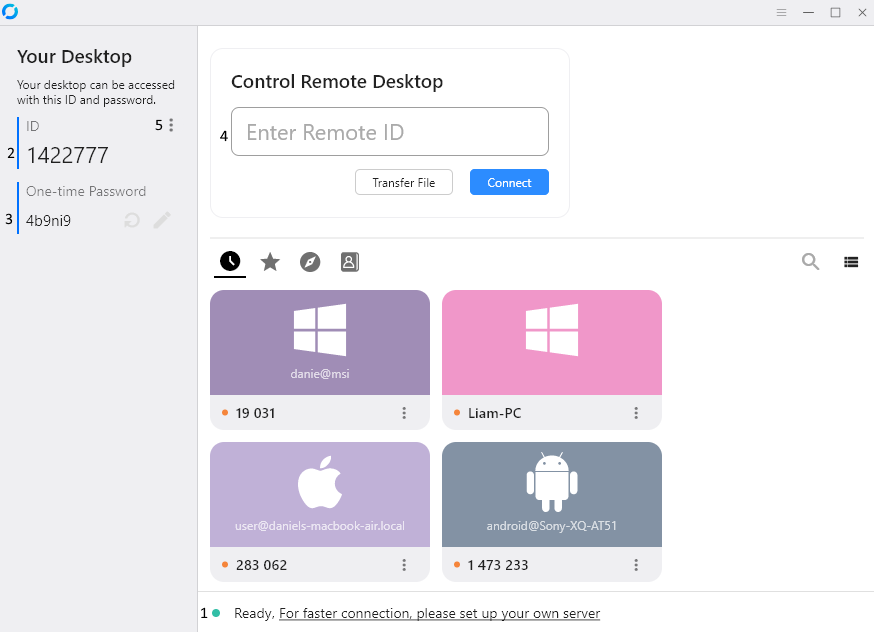
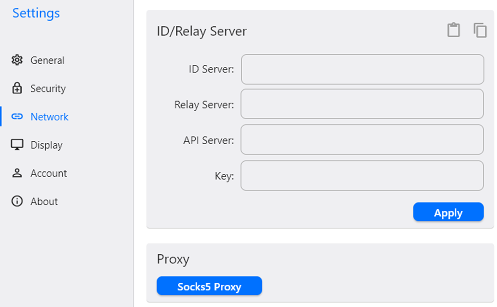

### Chapter 1

### Introduction
The RustDesk client is used on devices to connect via our RustDesk Server either opensource or Pro, it is available to download from [GitHub](https://github.com/rustdesk/rustdesk/releases)

### Supported Platforms
- Microsoft Windows (all current versions with our standard client and some older versions with out sciter client).
- Mac OS
- Debian Derivatives (Ubuntu, Mint etc)
- Redhat Derivatives (Centos, Rocky etc)
- Arch/Manjaro
- Opensuse
- Android
- iOS (Not support being controlled)
- Web

### Installation

#### Windows

Download the exe from GitHub and install

To install silently call the install exe with `--silent-install`.

#### Mac OS

Download the dmg file from GitHub more info can be found on the Mac OS page.

Open the .dmg file and drag `RustDesk` to `Applications`.

Allow RustDesk to run

Enable permissions requested and follow prompts on the left hand side of RustDesk to finish setup.

#### Linux

Please see below instructions to install for the various "flavours" of linux, all installers are on GitHub.

#### Debian Derivatives (>= 16)

```bash
# please ignore the wrong disk usage report
sudo apt install -fy ./rustdesk-<version>.deb
```

#### CentOS/Fedora (>= 18)

```sh
sudo yum localinstall ./rustdesk-<version>.rpm
```

#### Arch/Manjaro

```sh
sudo pacman -U ./rustdesk-<version>.pkg.tar.zst
```

#### Opensuse (>= Leap 15.0)

```sh
sudo zypper install --allow-unsigned-rpm ./rustdesk-<version>-suse.rpm
```
#### Android
Install apk from our GitHub more info can be found on the Android page.

### Usage
Once installed (or run as a temporary executable) RustDesk will connect to the Public servers (you will see a message at the bottom saying (1) "Ready, For faster connection, please setup your own server). In the Top left you will see your (2) ID and (3) One Time Password and on the (4) Right a box for you to connect to another computer if you know their ID.




To access the settings, click on the (5) 3 dots to the right of ID.

Under Settings you will find:
- General - Service Control, Theme, Hardware Codec, Audio, Recording and Language
- Security - Permissions for someone taking control, Password options, ability to change your ID and Advanced Security Settings
- Network - Set your own server settings here and proxy
- Display - Control the display settings for remote sessions and other default options, sync clipboard etc
- Account - This can be used in conjuction with the Pro Server to sign into the API
- About - Shows information about the software.

### Configuring RustDesk
There is number of ways to configure RustDesk.

The easiest way is using RustDesk Server Pro you can obtain an encrypted config string, this can be used in conjuction with `--config` to import settings. To do this:
1. Open command line on whichever OS you use, to the folder where RustDesk is installed ie C:\program files\RustDesk on windows, /usr/bin on linux.
2. Use the command `rustdesk.exe --config your-encrypted-string` eg `rustdesk.exe --config 9JSPSvJzNrBDasJjNSdXOVVBlERDlleoNWZzIHcOJiOikXZr8mcw5yazVGZ0NXdy5CdyciojI0N3boJye`

You can manually setup a client, to do this
1. Click on Settings
2. Click on Network
3. Click Unlock Network Settings
4. Enter your ID, Relay, API (if using pro) servers and your key.



If you manually setup a client, you can retrieve the RustDesk2.toml (in the users folder) file and use `--import-config` in a similar way to the above example.

### Parameters

`--password` can be used to set a permanent password.
`--get-id` can be used to retrieve the ID.
`--set-id` can be used to set an ID, please note IDs should start with a letter.
`--silent-install` can be used to install RustDesk silently on windows.

Additional Advanced parameters can be found [here](https://github.com/rustdesk/rustdesk/blob/bdc5cded221af9697eb29aa30babce75e987fcc9/src/core_main.rs#L242)

{}
