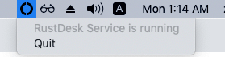
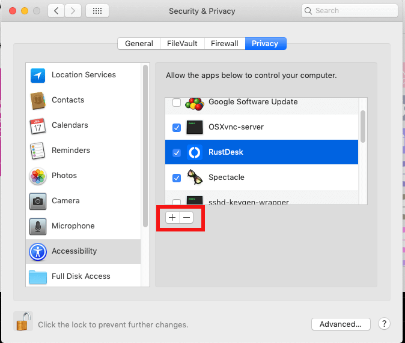
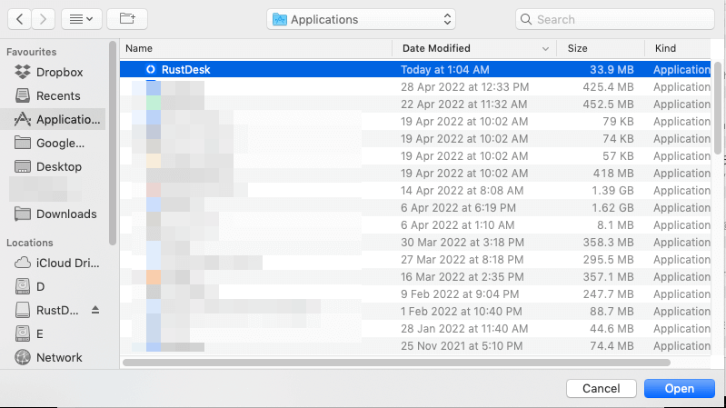
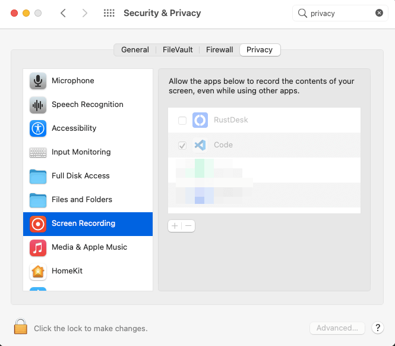

### 安裝
------

打開 .dmg 檔案並將 `RustDesk` 拖到 `應用程式`，如下所示。

確保您已退出所有正在執行的 RustDesk。還要確保退出托盤上顯示的 RustDesk 服務。

### 允許 RustDesk 執行

| 解鎖以變更 | 點擊 "App Store 和已確認的開發者"  |
| ---- | ---- |
|||

### 啟用權限

{}
MacOS 的安全政策更動，導致我們擷取本機端輸入的 API 失效。您必須在本機 Mac 端啟用 "輸入監測" 權限。

請遵照
[https://github.com/rustdesk/rustdesk/issues/974#issuecomment-1185644923](https://github.com/rustdesk/rustdesk/issues/974#issuecomment-1185644923)

It seems no quick fix, we need to fix together with our Flutter version.
{}

若要擷取畫面，您需要授予 `RustDesk` **輔助功能**權限和**畫面錄製**權限。RustDesk 將引導您進入設定視窗。

| RustDesk 視窗 | 設定視窗 |
| ---- | ---- |
|||

如果您在設置視窗中啟用了它，但 RustDesk 仍然發出警告。請通過 `-` 按鈕從設置視窗中刪除 RustDesk，然後單擊 `+` 按鈕，在 `/Applications` 中選擇 RustDesk。

| `-` 和 `+` 按鈕 | 選擇 RustDesk |
| ---- | ---- |
|||

請按照上面相似步驟設置**畫面錄製**權限。

