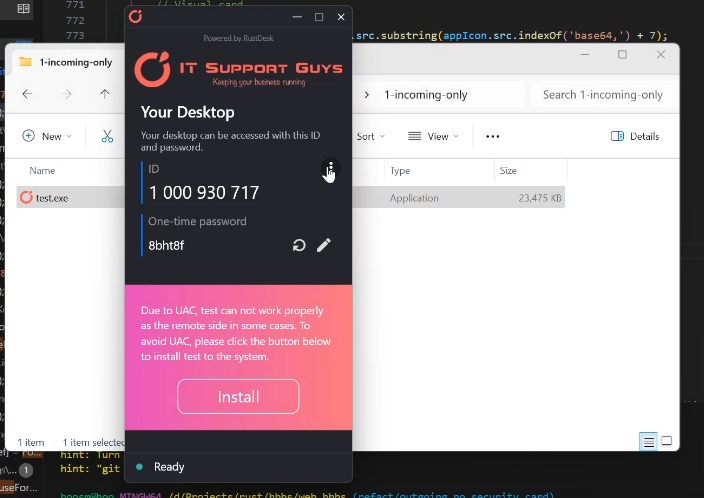
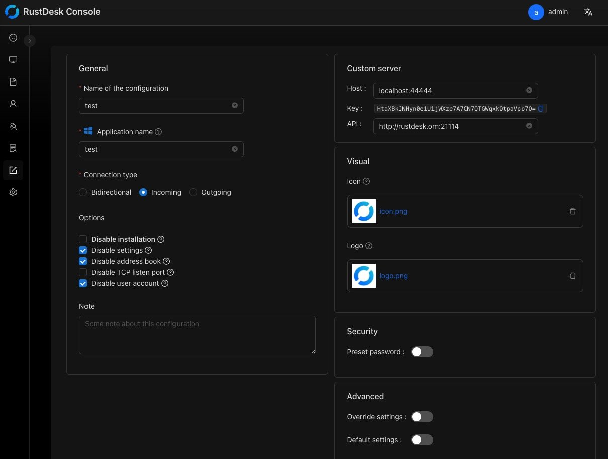

### Overview

There are a number of ways to configure RustDesk Clients to use your own self-hosted server, we will cover some below.

### 1. Custom client generator (Pro only)

You can have your own name, logo, icon, config, be signed and more. 

[Videos](https://twitter.com/rustdesk/status/1769171628426944539)




### 2. Manual Config

In the main RustDesk Client home click on the Menu button [ &#8942; ] next to your ID then click on Network, you can now unlock the settings using elevated privileges and set your ID, Relay, API and Keys.


Enter the `hbbs` host or IP Address in the **ID Server** input box (local side + remote side). The other two addresses can be left blank, RustDesk will automatically deduce (if not specially set), and the Relay Server refers to `hbbr` (port 21117).

e.g.

```nolang
hbbs.example.com
```

or

```nolang
hbbs.example.com:21116
```

#### Set `Key`

As a `Pro` user you will be able to retrieve the `Key` from the [web console](https://rustdesk.com/docs/en/self-host/rustdesk-server-pro/console/), or you can find it in `id_ed25519.pub` file under your working directory.


#### Set `API Server`

This is for `Pro` user only. When you can log in on web console, but fail to log in on RustDesk client, it probably you have not set `API Server` correctly.

If your API Server does not run on default `21114` port, please specify `API Server` explicitly.
e.g. your API Server runs on default https port, please specify `API Server` with `https://hbbs.example.com`.

If you still can not confirm the value of `API Server`, please go to the welcome page of web console, the `API Server` is shown in above picture (The input box with `API:` label).

### 3. Setup Using Import or Export

1. Use the steps [above](https://rustdesk.com/docs/en/self-host/client-configuration/#manual-config) to configure RustDesk Client on a Device.
2. Using the above machine go to Settings then Network and unlock.
3. Click on `Export Server Config`.
4. Paste the copied string into Notepad or similar.
5. Go to new client, copy the above to clipboard.
6. Go to Settings then Network in RustDesk Client, unlock and click `Import Server Config`.
7. It will automatically paste the settings in.
8. Click `Apply`.

### 4. Automatic Config

The easiest way to setup automatically is using deployment scripts found [here](https://rustdesk.com/docs/en/self-host/client-deployment/).

You can fix the Password is required and use a reverse Base64 string in the format `{"host":"HOSTADDRESS","key":"HOSTKEY","api":"http://HOSTADDRESS:21114"}` to automatically configure the clients, this is available automatically with RustDesk Server Pro via the console.

You can also use the steps from [above](https://rustdesk.com/docs/en/self-host/client-configuration/#setup-using-import-or-export) to export the string, remove any `=` at the start or end of the string. Restart RustDesk Client if settings don't show.

### 5. Put config in rustdesk.exe file name (Windows only)

Change `rustdesk.exe` to rustdesk-`host=<host-ip-or-name>,key=<public-key-string>`.exe, e.g. rustdesk-`host=192.168.1.137,key=xfdsfsd32=32`.exe. You can see the config result in the About Window below.

As a `Pro` user you will be able to retrieve the whole encrypted string from the [web console](https://rustdesk.com/docs/en/self-host/rustdesk-server-pro/console/) then download and rename the RustDesk Client exe, you can upload this somewhere easy for your customers to use.


<a name="invalidchar"></a>
{}
You need to set both `host` and `key`, missing either one will not work.

Optionally add a `,` (comma) character after the key, before the `.exe` part as a delimiter, to avoid the key being mangled if Windows or the browser renames the file when downloading duplicated names, e.g. `host=<host-ip-or-name>,key=<public-key-string>,.exe`.

If there are invalid characters in the key which can not be used in a Windows file name, please remove the
`id_ed25519` file from your server and restart `hbbs`/`hbbr`. This will cause the `id_ed25519.pub` file to regenerate. You may need to
repeat this process until you get valid characters.
{}

#### Embrase config string with `--` in the name

Example: `rustdesk--{config-string}--.exe`

{}
Please do not use `-licensed-` together with `--`, e.g. `rustdesk-licensed-{config-string}--.exe` does not work in version 1.2.3. We will fix it in version 1.2.4.
{}

We have noticed that in some cases, when double downloaded, something like `copy (1)` is added to the end of the file name, and this ruins the config.

By adding `--` at the end right after our config string, even if something is added to the file name, it won't corrupt the config string, and RustDesk will correctly retrieve it.

### 6. [Hardcoding Custom Settings](https://rustdesk.com/docs/en/self-host/client-configuration/hardcode-settings/)

### 7. Use command line `--config`
`rustdesk.exe --config <config-string>`

You can get the config string from web console (you can see it on above picture) or from RustDesk client "Settings → Network" ([here](https://github.com/rustdesk/rustdesk/discussions/7118) is a discussion about this).
