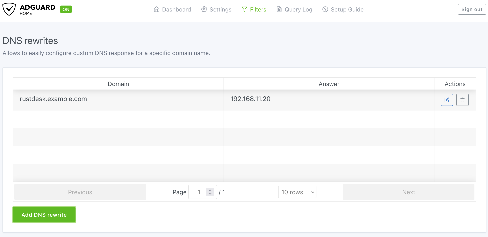
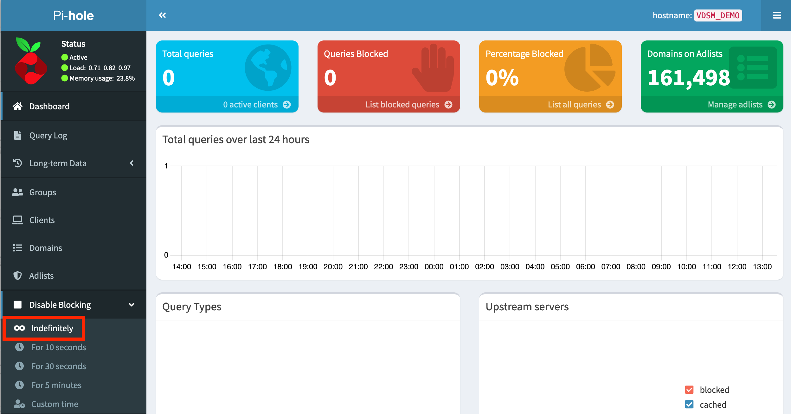
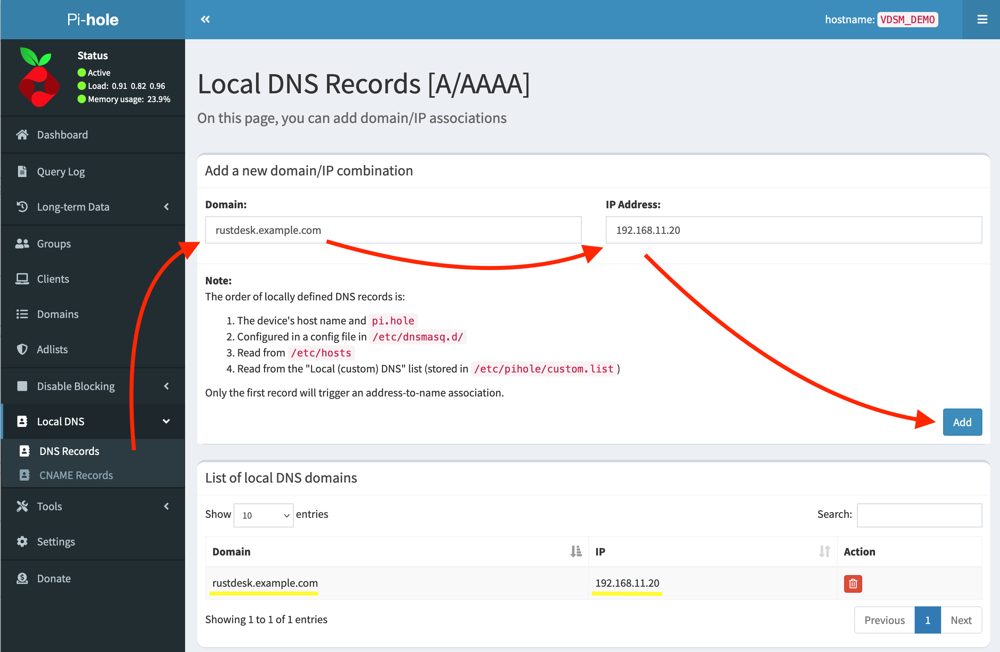

{}
This explanation involves complex networking knowledge, we need your assistance to improve its readability.
{}


For more details about NAT Loopback, please check the [Wikipedia](https://en.m.wikipedia.org/wiki/Network_address_translation#NAT_hairpinning) page.

When you're deploying RustDesk server on your home network or any other network environment that is behind a NAT firewall, the RustDesk server and your clients **MUST** either:
A: Use the local ip addresss to access each other OR:
B: Have a firewall that supports and has enabled the NAT Loopback.

You may notice you are unable to connect to your server through your **Public IP** or **Domain** (Which in theory points to your public IP).

## Problem 
In this example we will follow what happens when LAN devices try connecting to `rustdesk.example.com`. Assume your router's public IP will be `172.16.16.1`, the LAN IP of your server is `192.168.11.20` and the domain you desire is `rustdesk.example.com`, and you have a client with using '192.168.11.2'.

When you setup a server behind the router's NAT you can add a port forward in the router to change any incoming messages to the PUBLIC IP 172.16.16.1 to go to the server at 192.168.11.20

When a LAN device wants to access the internet, say a webserver on 8.8.8.8, it sends the request as coming from 192.168.11.2, and sends it to the router.  The router will intercept that request and will rewrite that request to 8.8.8.8 as coming from 172.16.16.1.  When 8.8.8.8 replies to 172.16.16.1 the router will check for a previous conneciton and re route that responce back to 192.168.11.2.

If the user at 8.8.8.8 sends a message to our network using 172.16.16.1 the port forward rull will change the destination of 172.168.16.16.1 to the server at 192.168.11.20 leaving the source of the request as 8.8.8.8 so the server can respond (more or less) direclty to 8.8.8.8.

If the user 8.8.8.8 decides to try to hack our network and claims to be sending it's messages from 192.168.11.2 the router knows that traffic comeing from 192.168.11.2 is only valid from the LAN devices and will typically block that traffic.  

The problem occurs when you try to loop back into the LAN.  If the LAN device tries to connect to `rustdesk.example.com`, which will be `172.16.16.1`.  At this point the router has lots of choices to make.  It just sent a message from it's LAN port to it's WAN port coming FROM 192.168.11.2 going to 172.16.16.1.  Once it hit's the WAN port this message is indistingusable by itself from the above example where someone on the internet was trying to hack into our network.

The NAT Loopback feature will effectively change the source "From 192.168.11.2" part of the address earlier in the process so that it knows it has to use the NAT table to pass messages back and forth between the server and the client.  

If there is an issue with connections only while you are inside the LAN, but it works fine from offsice this may be the problem you are having.  


## Solutions
There are three ways to solve this issue.

### 1. Set up NAT Loopback on your router
You could set up NAT Loopback on your router if you know how to, but setting this requires knowledge of networking. Some routers don't have the ability to adjust this setting, so this is not the best option for everyone.

{}
An article from [MikroTik](https://help.mikrotik.com/docs/display/ROS/NAT#NAT-HairpinNAT) explains this very well. You could start learning from here.
{}

### 2. Deploy a DNS server on your LAN
First, choose which you prefer, [AdGuard Home](https://github.com/AdguardTeam/AdGuardHome/wiki/Docker) or [Pi-hole](https://github.com/pi-hole/docker-pi-hole). You could deploy it through docker, or you could deploy on the same server as your RustDesk Server. The example below will show you some steps for this example.

Both of them are DNS based adblockers, but you could disable this functionality if you don't want to block ads.

First, point your `domain` to your RustDesk server's LAN IP (for example `192.168.11.20`). Then go to your router's `DHCP` setting (Caution: NOT WAN) and set your `First` DNS IP to the server that you deployed AdGuard Home or Pi-hole. `Secondary` DNS could be your ISP's DNS or other public DNS, e.g. `1.1.1.1` for Cloudflare or `8.8.8.8` for Google, and you're done!

Here is an example:
#### AdGuard Home
Blocking ads may cause problems, if you don't want to figure out the solution and want to disable this functionality, click "Disable protection" button.


<br>

Go to "DNS rewrites" setting.


<br>

Click "Add DNS rewrite", then type your `domain` and server's `LAN IP` in the field.


Here is what the final result looks like.



***Don't forget to assign your AdGuard Home to your router's LAN DHCP!***
<hr>

#### Pi-hole
Blocking ads may cause problems, if you don't want to figure out the solution and want to disable this functionality, click "Indefinitely" button within the "Disable Blocking" submenu.



Go to "Local DNS → DNS Records".
Type your `domain` and `IP` to the box, than click "Add".

To check the final results, check the yellow lines in this picture.



***Don't forget to assign your Pi-hole to your router's LAN DHCP!***

### 3. Add rules to your hosts file
This method is only recommended if you have a small number of devices. If you have many devices the DNS method is preferred. Otherwise you would have to manually do this on each device that needs access to the server.

{}
If this method is used on a portable device like a laptop, it will not be able to connect to the server when outside your LAN.
{}

Path for different OS:

#### Windows
```text
C:\Windows\system32\drivers\etc\hosts
```
You can edit with elevated privilages or you can copy this file to `Desktop` and edit it. After you edit it, copy back to original path.

#### macOS
```text
/etc/hosts
```
You could use `vim`, it is pre-installed.
```sh
sudo vim /etc/hosts
```

#### Linux
```text
/etc/hosts
```
You could use `vim` or `nano`.
```sh
sudo vim /etc/hosts
```

<hr>

The format is the same in all three operating systems. `IP` first followed by `domain`. One entry per line.

For example:
```text
192.168.11.20   rustdesk.example.com
```

