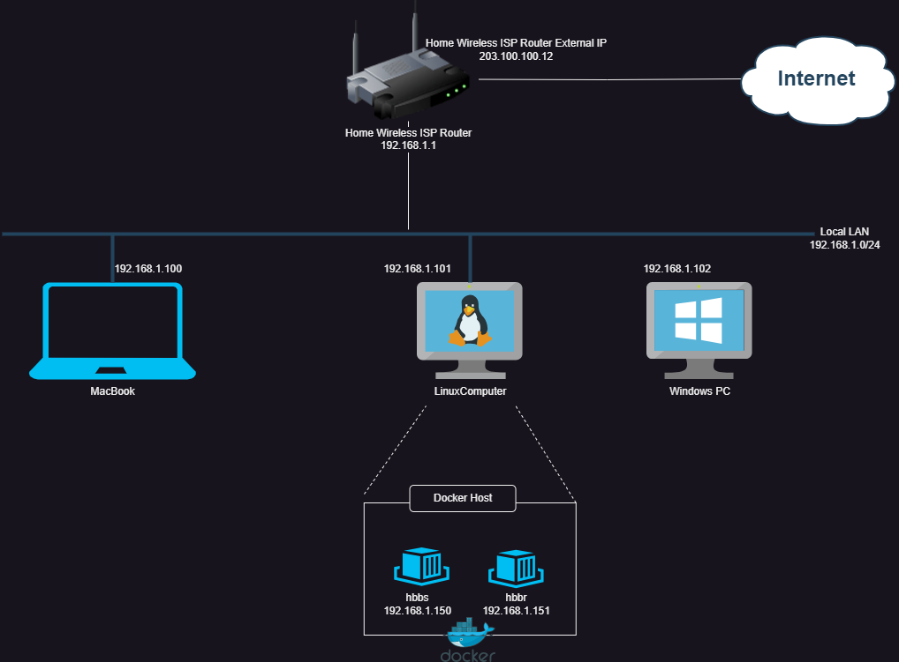

{}
This explanation involves complex networking knowledge, we need your assistance to improve its readability.
{}


For more details about NAT Loopback, please check the [Wikipedia](https://en.m.wikipedia.org/wiki/Network_address_translation#NAT_hairpinning) page.

In a nutshell, NAT loopback is the feature of a router that can route a network request for an external IP address from an internal network or device back to the same network rather than directing it to the internet. To understand NAT loopback in more detail, let's take a look at a simplified home network diagram below:


1. MacBook: A MacBook on your internal network you run the Rustdesk client to connect to the Windows PC.
2. LinuxComputer: This is another computer running on your internal network where you installed docker and you run the two Rustdesk containers: hbbs(RustDesk ID rendezvous / signaling server) and hbbr (RustDesk relay server). Both containers have dedicated IP addresses (192.168.1.150 and 192.168.1.151) configured as per the Docker installation guide (https://rustdesk.com/docs/en/self-host/rustdesk-server-oss/docker/).
3. Windows PC: Runs the Rustdesk client listening for incoming Rustdesk client connections.

When the MacBook connects to the Windows PC using the internal IP address (192.168.1.102) the connection works as long as the the Rustdesk client network settings on the MacBook is configured to use the internal IP addresses (192.168.1.150 and 192.168.1.151) for the ID server and Relay server. However, when the MacBook connects to the Windows PC using an external domain name from the internal network there are a couple of things you need to configure as a prerequisite:

1. You need an external domain registered (eg. myowndomain.com) as a prerequisite for this scenario. 
2. You need to configure an A record under myowndomain.com (eg. "remoteconnection") so that remoteconnection.myowndomain.com resolves to your external ISP IP address (203.100.100.12).
3. You need Nat Loopback configured on your Home Wireless ISP Router with DNAT/port forwarding rules configured.

## Without Nat Loopback
Without the Nat Loopback configured on your Home Wireless ISP Router receives the packet from the MacBook the following happens:

Source IP: 192.168.1.100
Destination IP: 203.100.100.12
Action: Your Home Wireless ISP Router forwards the packet to it's Default Gateway IP. This is usually the IP address of your ISP where the packet is dropped by the ISP.

## With Nat Loopback
Nat Loopback requires additional configuration on your router. When configured the following happens:

Source IP: 192.168.1.100
Destination IP: 203.100.100.12
Action: The router detects that the destination IP is its own WAN IP address and:  
- The router changes the Source IP to 203.100.100.12
- The router determines the destination for the packet based on DNAT (port forwarding) rules and forwards the packet to the internal IP address of the Rustdesk server.

## Solutions and Workarounds
There are three ways to solve this issue.

### 1. Set up NAT Loopback on your router
You could set up NAT Loopback on your router if you know how to, but setting this requires knowledge of networking. Some routers don't have the ability to adjust this setting, so this is not the best option for everyone.

{}
An article from [MikroTik](https://help.mikrotik.com/docs/display/ROS/NAT#NAT-HairpinNAT) explains this very well. You could start learning from here.
{}

### 2. Deploy a DNS server on your LAN
First, choose which you prefer, [AdGuard Home](https://github.com/AdguardTeam/AdGuardHome/wiki/Docker) or [Pi-hole](https://github.com/pi-hole/docker-pi-hole). You could deploy it through docker, or you could deploy on the same server as your RustDesk Server. The example below will show you some steps for this example.

Both of them are DNS based adblockers, but you could disable this functionality if you don't want to block ads.

First, point your `domain` to your RustDesk server's LAN IP (for example `192.168.11.20`). Then go to your router's `DHCP` setting (Caution: NOT WAN) and set your `First` DNS IP to the server that you deployed AdGuard Home or Pi-hole. `Secondary` DNS could be your ISP's DNS or other public DNS, e.g. `1.1.1.1` for Cloudflare or `8.8.8.8` for Google, and you're done!

Here is an example:
#### AdGuard Home
Blocking ads may cause problems, if you don't want to figure out the solution and want to disable this functionality, click "Disable protection" button.


<br>

Go to "DNS rewrites" setting.


<br>

Click "Add DNS rewrite", then type your `domain` and server's `LAN IP` in the field.


Here is what the final result looks like.


***Don't forget to assign your AdGuard Home to your router's LAN DHCP!***
<hr>

#### Pi-hole
Blocking ads may cause problems, if you don't want to figure out the solution and want to disable this functionality, click "Indefinitely" button within the "Disable Blocking" submenu.


Go to "Local DNS → DNS Records".
Type your `domain` and `IP` to the box, than click "Add".

To check the final results, check the yellow lines in this picture.


***Don't forget to assign your Pi-hole to your router's LAN DHCP!***

### 3. Add rules to your hosts file
This method is only recommended if you have a small number of devices and will only work when you connect from your internal network. This workaround essentially makes sure that the external domain name resolves to the internal IP address of your Rustdesk server. If you have many devices the DNS method is preferred. Otherwise you would have to manually do this on each device that needs access to the server.

{}
If this method is used on a portable device like a laptop, it will not be able to connect to the server when outside your LAN.
{}

Path for different OS:

#### Windows
```text
C:\Windows\system32\drivers\etc\hosts
```
You can edit with elevated privilages or you can copy this file to `Desktop` and edit it. After you edit it, copy back to original path.

#### macOS
```text
/etc/hosts
```
You could use `vim`, it is pre-installed.
```sh
sudo vim /etc/hosts
```

#### Linux
```text
/etc/hosts
```
You could use `vim` or `nano`.
```sh
sudo vim /etc/hosts
```

<hr>

The format is the same in all three operating systems. `IP` first followed by `domain`. One entry per line.

For example:
```text
192.168.11.20   rustdesk.example.com
```
