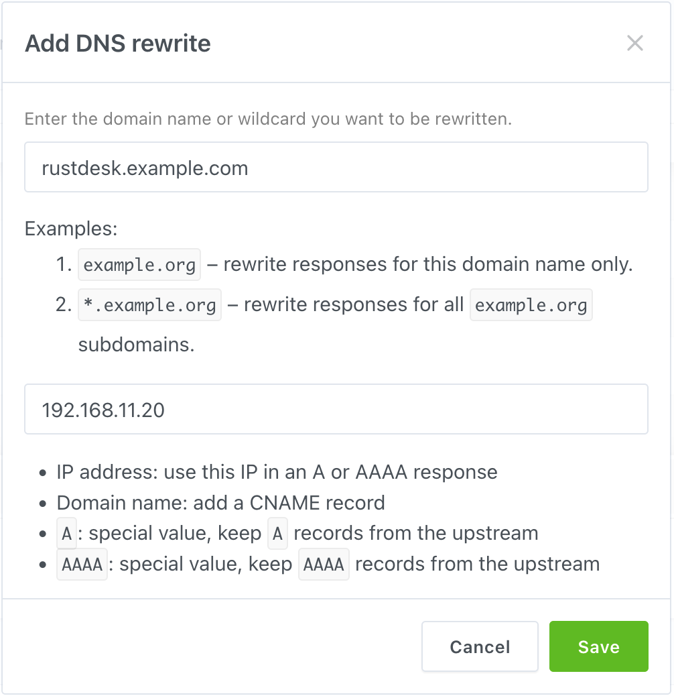

{}
This explanation involves complex networking knowledge, we need your assistance to improve its readability.
{}

When you're deploying RustDesk server on your home or any environments that you will put your RustDesk server and your clients on **same LAN or behind same router**, you may notice you're unable to connect to your server though your **``Public IP``** or **``Domain``** (Which in theory point to your public IP).

More details about NAT Loopback, please check [Wikipedia](https://en.m.wikipedia.org/wiki/Network_address_translation#NAT_hairpinning) page.

Explain this in simple way:

For example: Your router's public IP is ``8.8.8.8``, the LAN IP of your server is ``192.168.11.20`` and the domain you desired is ``rustdesk.example.com``, and you did set up your router port forwarding to your server behind your LAN(NAT/router).

Your client and server are behind same router, so when your LAN devices connecting to ``rustdesk.example.com`` , first, it will query its IP, which will be ``8.8.8.8``, and connect to this IP, then your router may just **don't know** where this connection need to go, it will think this connection want to router itself, and your connection will failed.

## Solutions
There has three way to overcome this issue.

### 1. Set up NAT Loopback on your router 
You could set up NAT Loopback on your router if you know how to, but setting this need difficult knowledge of networking or some router may just don't have the ability to adjust this setting, so won't talking more about this.
{}
An article from [MikroTik](https://help.mikrotik.com/docs/display/ROS/NAT#NAT-HairpinNAT) is explaining this very well, you could start learning from here.
{}

### 2. Deploy a DNS server on your LAN
First, choose which you're prefer, [AdGuard Home](https://github.com/AdguardTeam/AdGuardHome/wiki/Docker) or [PiHole](https://github.com/pi-hole/docker-pi-hole), you could deploy it though docker and you could deploy on same server of your RustDesk Server, the example blow will doing this for example.

Both of them are DNS based adblocker, you could disable this functionality if you don't want to block ads.

Than go to it's setting, point your ``domain`` to your RustDesk server's LAN IP (For example: ``192.168.11.20``), and go to your router's ``DHCP`` setting (CAUTION: NOT WAN), set your ``First`` DNS IP to the server that you deployed AdGuard Home or PiHole, and ``Secondary`` DNS could be your ISP's DNS or other public DNS, eg. ``1.1.1.1`` for Cloudflare, ``8.8.8.8`` for Google, and you're done!

Here is example:
#### AdGuard Home
Block ads may cause problems, if you don't want to figure out the solution and want to disable this functionality, click "Disable protection" button.


<br>

Go to "DNS rewrites" setting.


<br>

Click "Add DNS rewrite", than type your ``domain`` and server's ``LAN IP`` in the field.


Here is the final result looks like.


***Don't forget to assign your AdGuard Home to your router's LAN DHCP!***
<hr>

### PiHole
Block ads may cause problems, if you don't want to figure out the solution and want to disable this functionality, click "Indefinitely" button within the "Disable Blocking" submenu.


Goto Local DNS >  DNS Records
Type your `domain` and `IP` to the box, than click "Add".

To check the final results, check the yellow lines in this picture.


***Don't forget to assign your PiHole to your router's LAN DHCP!***
### 3. Add rules to your hosts file
Only recommend this method when you have only few devices, if you have many devices, DNS method is more recommend.

{}
**DON'T** use this method if your environment have laptops, because this laptop will not able to connect the server when outside your LAN.
{}

 

Path for different OS:

> Windows
```plaintext
C:\Windows\system32\drivers\etc\hosts
```
Copy this file to ``Desktop`` and edit it, after you edited, copy back to original path.

> macOS
```plaintext
/etc/hosts
```
You could use ``vim``, it is pre-installed
```bash
sudo vim /etc/hosts
```


> Linux
```plaintext
/etc/hosts
```
You could use ``vim`` or ``nano``
```bash
sudo vim /etc/hosts
```

<hr>

The format among three operating systems is same, all with ``IP`` first, than ``domain`` 

For example:
```plaintext
192.168.11.20   rustdesk.example.com
```