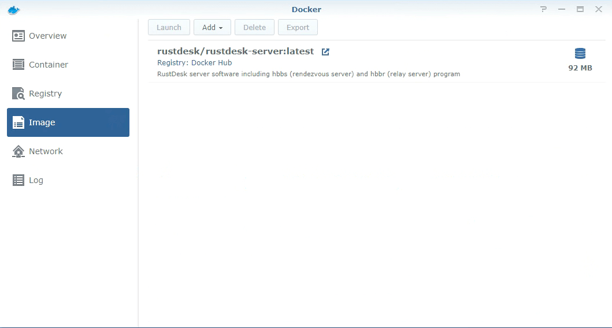

Diese Anleitung basiert auf dem aktuellen DSM v6.

### Docker installieren

Paketmanager öffnen und Docker installieren

|    |    |
| -- | -- |
|  |  |

### RustDesk-Server installieren

| RustDesk-Server im Docker-Register suchen und per Doppelklick installieren | RustDesk-Server-Image ist installiert, Doppelklick zum Erstellen des RustDesk-Server-Containers |
| -- | -- |
|  |  |

### hbbs-Container erstellen

Wie oben erwähnt, doppelklicken Sie auf das RustDesk-Server-Image, um einen neuen Container zu erstellen, und geben Sie ihm den Namen `hbbs`.

Klicken Sie auf "Erweiterte Einstellungen".

- Automatischen Neustart aktivieren

- Aktivieren Sie "Use the same network as Docker host". Mehr Infos über das Hostnetz siehe [hier](/docs/de/self-host/install/#net-host)

- Binden Sie ein Host-Verzeichnis (z. B. `Shared/test/`) als `/root` ein, hbbs wird einige Dateien (einschließlich der `key`-Datei) in diesem Verzeichnis erzeugen
| Einbinden | Im Host-Verzeichnis erzeugte Dateien |
| -- | -- |
|  |  |

- Befehl einstellen
{}
Das Betriebssystem von Synology basiert auf Debian, daher funktioniert das Hostnetz (--net=host) einwandfrei, wir müssen keine Ports mit der Option `-p` zuordnen.

`192.168.16.98` ist eine Intranet-IP, die hier nur zu Demonstrationszwecken verwendet wird. Bitte setzen Sie sie bei der Bereitstellung auf eine öffentliche IP.

{}

- Fertig

### hbbr-Container erstellen

Bitte wiederholen Sie die obigen Schritte für `hbbs`, ändern aber den Containernamen in `hbbr` und den Befehl in `hbbr`.

### hbbr/hbbs-Container

| Doppelklicken Sie auf den Container und prüfen Sie das Protokoll | Bestätigen Sie hbbs/hbbr über das Host-Netzwerk doppelt |
| -- | -- |
|  |  |
