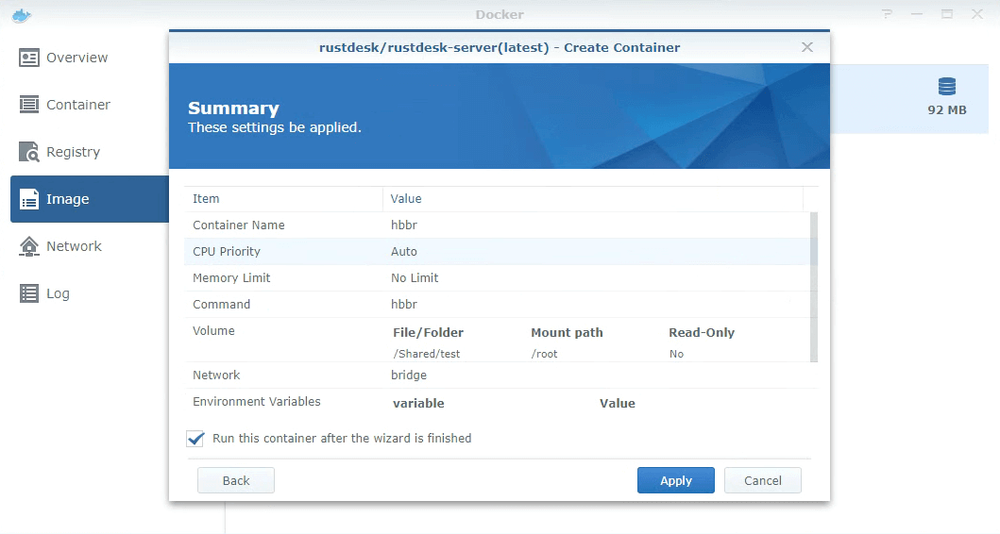
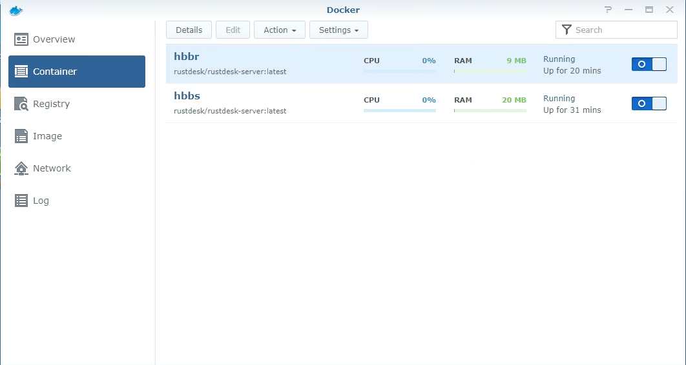

> An alternative up-to-date tutorial from third-party is [here](https://mariushosting.com/how-to-install-rustdesk-on-your-synology-nas/).

This tutorial is based on latest DSM v6 and v7.

{}
After DSM 7.2 update, the Docker is upgraded to new "Container Manager", please check [this article](/docs/en/self-host/rustdesk-server-oss/synology/dsm-7) instead.
{}

### Install Docker

| Open Package Center | Install Docker |
| --- | --- |
|  |  |

### Install RustDesk Server

| Search rustdesk-server in Docker's registry and install by double click | Installed rustdesk-server image, double click to create rustdesk-server container |
| --- | --- |
|  |  |

### Create hbbs container

As mentioned above, double click on rustdesk-server image to create new container, set it name to `hbbs`.

Click on above `Advanced Settings`.

- Enable `Enable auto-restart`.

- Enable `Use the same network as Docker Host`. For more about host net, please [check](https://rustdesk.com/docs/en/self-host/rustdesk-server-oss/docker/#net-host).

- Mount a host directory (e.g. `/home/rustdesk/`) to `/root`, hbbs will generate some files (database and `key` files) in this directory which need to be persistent over reboots.

| Mount | Files generated in the host directory |
| --- | --- |
|  |  |

- Set command
{}
Synology's OS is Debian based, so host net (--net=host) works fine, we do not need to map ports with `-p` option.

`192.168.16.98` is an internal IP used here for demonstration only, please set it to a public IP when you deploy (or you can use your DDNS address if you have configured one in "Control Panel → Connectivity → DDNS") and don't forget to open ports on your router and your Synology firewall if this is enabled ("Control Panel → Connectivity → Firewall")!

{}

- Done

### Create hbbr container

Please repeat above `hbbs` steps, but name the container `hbbr` and command (for Set Command Step) should be `hbbr -k _`.

### hbbr/hbbs containers

| Double click on container and check log | Double confirm hbbs/hbbr using host network |
| --- | --- |
|  |  |

### Retrieve your Key

Browse to the folder setup before using File Station, download `id_ed25519.pub` and open with a text editor to via your key.
