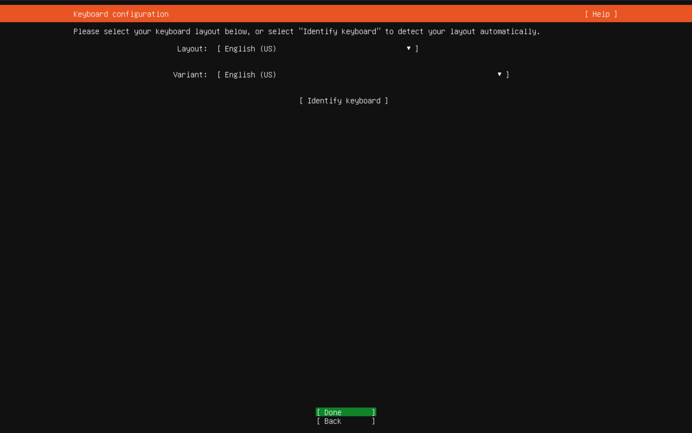
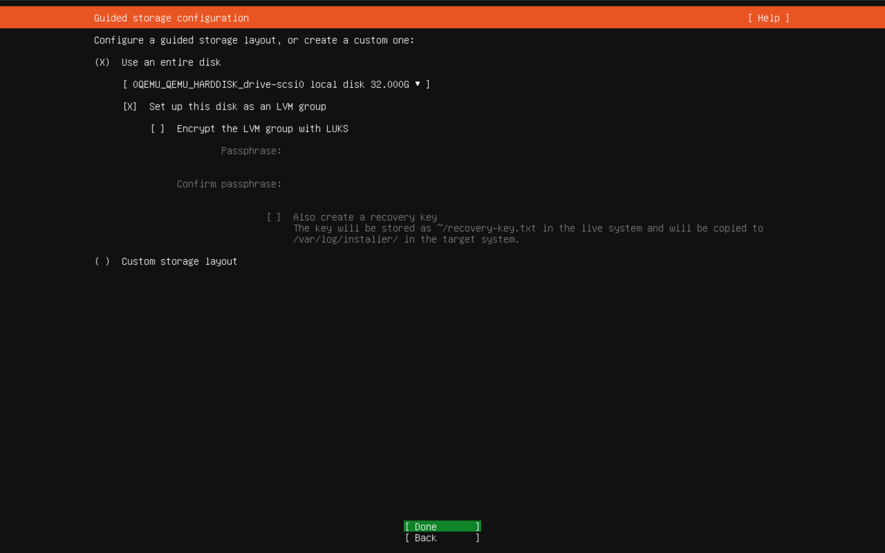
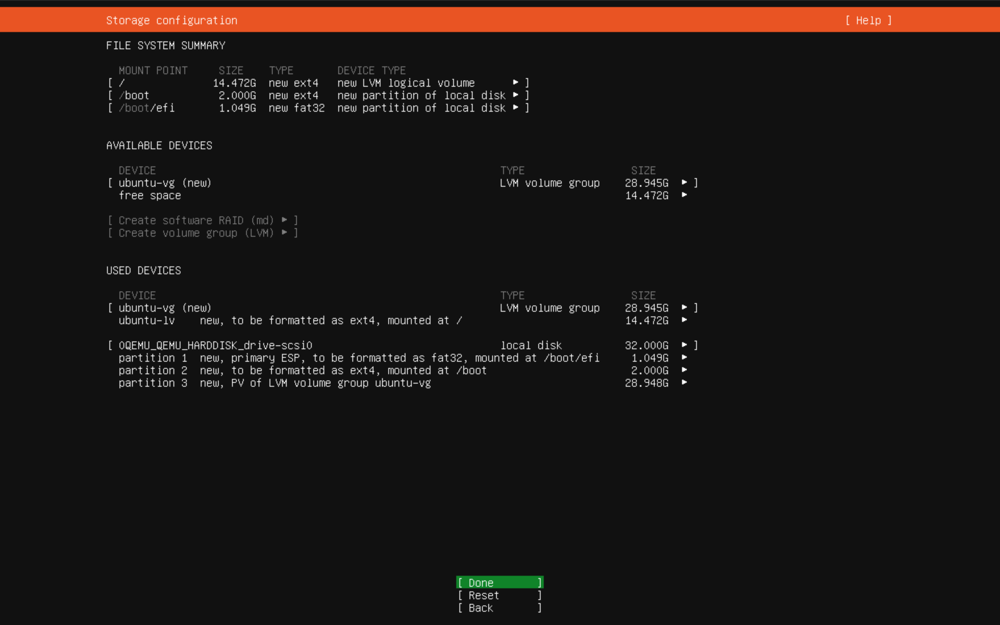
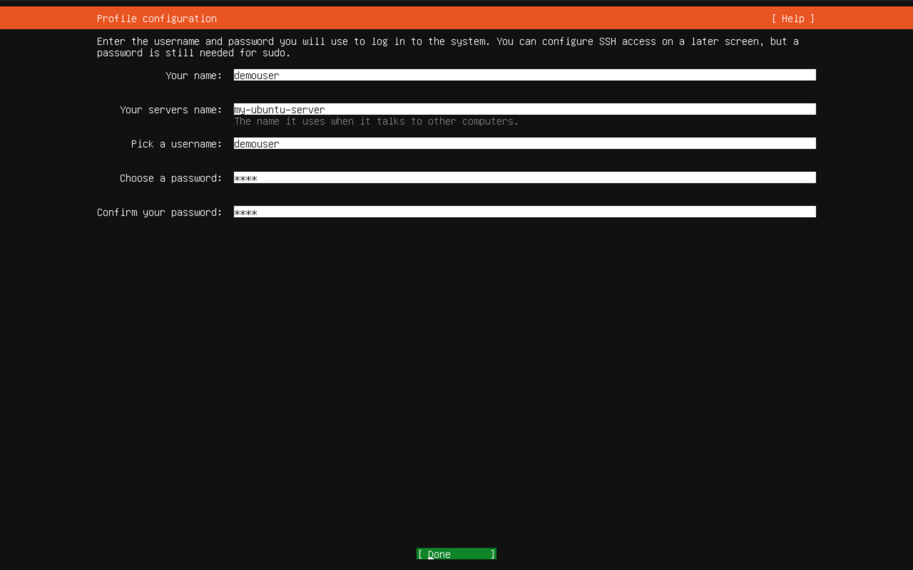
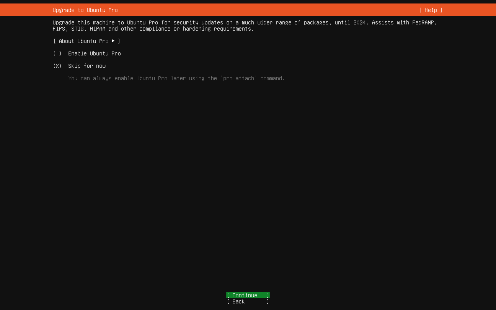
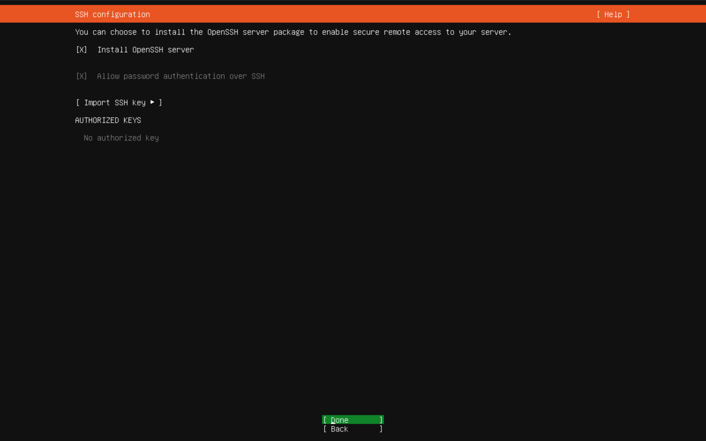
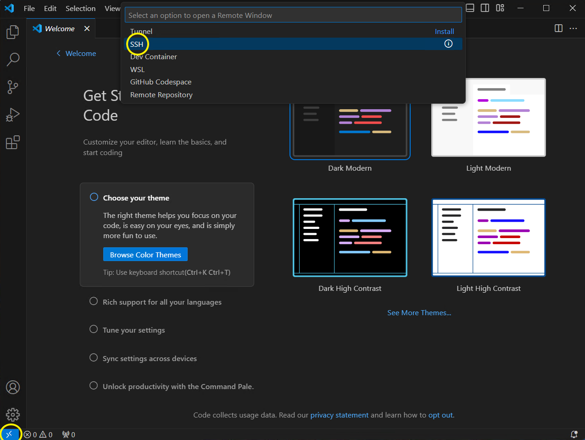

Das folgende Tutorial wird Ubuntu Server **22.04 minimal** als Beispiel verwenden. Vor allem mit der Befehlszeile, weil die niedrigste Preisklasse von VPS nicht mit der Desktop-Umgebung umgehen kann.

### Vorbereitung

> Erstens brauchen Sie:
* [Visual Studio Code](https://code.visualstudio.com)
* (Optional) Suchen Sie Ihre [Zeitzone](https://en.wikipedia.org/wiki/List_of_tz_database_time_zones) und merken Sie sie sich, oder die Zeitzone Ihres Systems ist UTC+0

> Wenn Sie mit Ihrem lokalen Rechner installieren wollen, nehme ich an, dass Sie Ihren Ubuntu-Server als virtuelle Maschine installieren.<br>
> Außerdem brauchen Sie:
* Öffentliche IP, dynamische IP ist in Ordnung, aber eine statische IP wäre besser
* [Ubuntu Server-ISO](https://ubuntu.com/download/server)
* Möglichkeit zur Einrichtung der Portweiterleitung auf Ihrem ISP-Modem oder -Router. Wenn Sie diese Geräte von Ihrem ISP erhalten haben und nicht wissen, wie Sie auf die Verwaltungsseite gelangen, fragen Sie bitte Ihren ISP.

### VPS/VM-Spezifikationen auswählen und einstellen

Wenn Sie nur RustDesk Server betreiben wollen, sollte die niedrigste Spezifikation ausreichen, mit Ausnahme von AWS Lightsail, da dessen niedrigste Spezifikation 512 MB RAM beträgt, was zu niedrig ist und zum Absturz führen kann. Jede Spezifikation mit **1 GB RAM** sollte ausreichen.

Für selbst gehostete VMs sind **1 GB RAM und 32 GB** an Festplatten ausreichend. Das UEFI-BIOS wird bevorzugt.

Für jeden anderen Hypervisor, der unter Windows oder Linux mit GUI läuft, wie z. B. VirtualBox oder VMware Workstation, stellen Sie bitte Ihre virtuelle Netzwerkkarte auf den **Bridge**-Modus ein.

### 1. Ubuntu Server installieren

##### Überspringen Sie [2. Server einrichten](#2-server-einrichten), wenn Sie sich entscheiden, einen VPS zu mieten.

{}
Diese Anleitung geht davon aus, dass Sie Ihren Ubuntu-Server als virtuelle Maschine installieren. Wenn Sie sich für die Installation auf einer physischen Maschine entscheiden, kann es bei falscher Vorgehensweise zu **Datenverlust** kommen.
{}

{}
Verwenden Sie **Tab**, um durch die verschiedenen Optionen zu navigieren, verwenden Sie **Space**, um verschiedene Optionen auszuwählen, und drücken Sie **Enter**, wenn Sie auf **Done** klicken.
{}

1. Sprache wählen


2. Ihr Tastaturlayout wählen


3. Netzwerkkonfiguration, bitte DHCP beibehalten


{}
Nun können Sie in den DHCP-Einstellungen Ihres Routers nach der LAN-IP-Adresse Ihrer VM suchen und diese zur DHCP-Reservierung hinzufügen. Wenn Sie möchten, können Sie auch eine andere IP-Adresse zuweisen.
{}

4. Sie können einen Spiegelserver auswählen


5. Wählen Sie minimiert, um Speicher- und Festplattennutzung zu reduzieren


6. Gesamte Festplatte verwenden


7. Bestätigen Sie Ihre Festplattenoptionen


8. Legen Sie den Servernamen, den Benutzernamen und das Passwort fest.


9. Registrieren Sie sich unter [Ubuntu Pro](https://ubuntu.com/pro) oder überspringen Sie es


10. OpenSSH soll installiert werden


11. Überspringen Sie alles auf dieser Seite, denn es handelt sich um ein Snap-Paket


12. Nach der Installation können Sie ein automatisches Update durchführen lassen und danach neu starten.

### 2. Server einrichten

1. Öffnen Sie VSCode, klicken Sie auf die Schaltfläche in der linken Ecke und wählen Sie SSH


2. Geben Sie `username@IP` ein, zum Beispiel `demouser@192.168.2.98`, und dann `Enter`


3. Wählen Sie Ihr System `Linux`

4. Bestätigen Sie den Fingerabdruck des Servers

5. Geben Sie das Passwort Ihres Benutzers ein

6. Öffnen Sie Ihren Home-Ordner


7. Klicken Sie `Yes, I trust the authors`

8. Öffnen Sie ein Terminal


9. Pakete installieren
```
sudo apt install docker.io docker-compose python3-pip curl git vim nano zram-config -y
```

10. Disk Swap deaktivieren

Prüfen Sie, ob eine Auslagerungsdatei vorhanden ist
```
sudo vim /etc/fstab
```

Finden Sie etwas Ähnliches wie:
```
/swap.img       none    swap    sw      0       0
```
Falls nicht: Tippen Sie `:qa!` und dann `Enter` zum Beenden. Springen Sie zu Schritt 11

Wenn ja: Drücken Sie `i`, um den Bearbeitungsmodus zu aktivieren, und kommentieren Sie die Zeile mit `#` wie folgt:
```
#/swap.img       none    swap    sw      0       0
```
Drücken Sie `Esc` und geben Sie `:wq` ein und drücken dann `Enter`, um die Änderungen zu speichern.

11. ZRAM-Größe anpassen

ZRAM bedeutet "Komprimierter Speicher", ist effizienter und belegt keinen Speicherplatz.

```
sudo vim /usr/bin/init-zram-swapping
```

Finden Sie die Zeile mit
```
mem=$((totalmem / 2 * 1024))
```

Und passen Sie diese an::
```
mem=$((totalmem * 2 * 1024))
```
Speichern und beenden

12. Zeitzone festlegen

Finden Sie Ihre Zeitzone unter [Wikipedia](https://en.wikipedia.org/wiki/List_of_tz_database_time_zones)

```
sudo timedatectl set-timezone "Europe/Berlin"
```

13.  Neustart
```
sudo reboot
```
Nach dem Neustart verbinden Sie sich wieder mit Ihrem VSCode und öffnen das Terminal.

14. `swap.img` löschen

(Überspringen Sie es, wenn Sie keine haben.)

Wir haben die Auslagerungsdatei durch ZRAM ersetzt, jetzt können Sie `swap.img` bzw. mit einem anderen Namen löschen.
```
sudo rm /swap.img
```

### 3. RustDesk Server einrichten

1. Führen Sie diesen Befehl aus, um die erforderlichen Ordner einmal zu erstellen:
```
cd ~ && mkdir -p docker/rustdesk-server/data
```

2. `compose.yml` erstellen

Klicken Sie mit der rechten Maustaste auf den Ordner `rustdesk-server` und erstellen Sie eine neue Datei namens `compose.yml`.

Fügen Sie dies in `compose.yml` ein.

Nach dem Kopieren sollten Sie `rustdesk.example.com` (die auf Ihr `hbbr` verweist) durch die Domäne ersetzen, die auf Ihren Server verweist.

{}
Sie könnten die Zeile mit `hbbs` vorübergehend in die LAN-IP Ihres Servers ändern (wenn Sie in Ihrem LAN arbeiten), um sicherzustellen, dass er funktioniert. Nachdem Sie sich vergewissert haben, dass Ihr Server funktioniert, **sollten** Sie die Änderung zurücknehmen.
{}

{}
Haben Sie Probleme, nachdem Sie die LAN-IP in eine Domäne geändert haben? Dann sollten Sie [diesen Artikel](/docs/de/self-host/nat-loopback-issues/) lesen.
{}

```yaml
services:
  hbbs:
    container_name: hbbs
    image: rustdesk/rustdesk-server:latest
    command: hbbs -r rustdesk.example.com:21117
    volumes:
      - ./data:/root
    network_mode: host
    depends_on:
      - hbbr
    restart: always

  hbbr:
    container_name: hbbr
    image: rustdesk/rustdesk-server:latest
    command: hbbr
    volumes:
      - ./data:/root
    network_mode: host
    restart: always

# Weil der Docker-Host-Modus verwendet wird
# Nur für den Fall, dass Sie die Ports vergessen haben:
# 21114 TCP für Webkonsole, nur in der Pro-Version verfügbar
# 21115 TCP für NAT type test
# 21116 TCP TCP hole punching
# 21116 UDP heartbeat/ID server
# 21117 TCP relay
# 21118/21119 TCP für Websocket, wenn Sie einen Webclient betreiben wollen
```
Lesen Sie [hier](/docs/de/client), wie Sie Ihren Client einrichten. Nur `ID-Server` und `Key` werden benötigt. `Relais-Server` wird nicht benötigt, da wir ihn in `hbbs` festgelegt haben. Diese Informationen werden von `hbbs` automatisch bereitgestellt.

3. Server starten
```
cd ~/docker/rustdesk-server
sudo docker-compose up -d
```

4. Prüfen, ob es funktioniert

In Ihrem VSCode sollten Sie `id_ed25519` und `id_ed25519.pub` in Ihrem `docker/rustdesk-server/data` Ordner sehen. Klicken Sie auf `id_ed25519.pub`, dies ist der öffentliche Schlüssel, den Sie für Ihren RustDesk-Client benötigen.

Der öffentliche Schlüssel sieht so aus:


### 4. Portweiterleitung auf Ihrem Router/VPS einrichten

Gehen Sie auf die Verwaltungswebseite Ihres Routers und suchen Sie nach etwas, das mit `Port-Weiterleitung` zu tun hat. Es sollte unter `WAN`- oder `Firewall`-Einstellungen erscheinen.

Wenn Sie die Einstellung immer noch nicht finden können, suchen Sie mit Google nach `{Router-Hersteller} + Portweiterleitung` oder `{Router-Modell} + Portweiterleitung`. Wenn das Gerät von Ihrem ISP stammt, fragen Sie ihn.

Wenn Sie einen VPS verwenden, suchen Sie mit Google nach `Name des VPS-Anbieters` + `Firewall-Port`, um das spezifische Vorgehen für Ihren VPS zu finden.

Öffnen Sie die erforderlichen Ports:
  * `21114` TCP für Webkonsole, nur in der Pro-Version verfügbar
  * `21115` TCP für NAT type test
  * `21116` TCP TCP hole punching
  * `21116` UDP Heartbeat/ID-Server
  * `21117` TCP Relay
  * `21118/21119` TCP für Websocket, wenn Sie einen Webclient betreiben wollen

### 5. Einige Grundlagen

1. Wie wendet man die Einstellungen an, nachdem man `compose.yml` geändert hat?

Führen Sie dies erneut aus:
```
sudo docker-compose up -d
```

2. Wie kann man den Container anhalten und löschen?

(Ihre Daten werden dabei nicht gelöscht)
```
sudo docker-compose down
```

3. Wie kann man den Server sichern?

Führen Sie zuerst `sudo docker-compose down` aus, dann laden Sie ihn herunter.


Ziehen Sie ihn per Drag-and-drop in den VSCode Explorer, wenn Sie ihn hochladen möchten.

4. Wie kann der Container automatisch aktualisiert werden?

Verwenden Sie [Watchtower](https://containrrr.dev/watchtower/).

Erstellen Sie einen Ordner und legen Sie die Datei `compose.yml` darin ab.

```
mkdir ~/docker/watchtower
```
Wechseln Sie zu Ihrer Zeitzone bei `TZ`.

Wenn Sie keinen Containernamen angegeben haben, werden **alle** Ihrer Container aktualisiert.

Beim folgenden Befehl wird die Aktion jeden Tag um 3 Uhr morgens ausgeführt, weitere Details finden Sie in der [Dokumentation](https://containrrr.dev/watchtower/arguments/#scheduling).

```yaml
version: "3"
services:
  watchtower:
    image: containrrr/watchtower:latest
    container_name: watchtower
    network_mode: bridge
    volumes:
      - /var/run/docker.sock:/var/run/docker.sock
    environment:
      TZ: Europe/Berlin
    command: --cleanup --schedule "0 0 3 * * *" hbbr hbbs
    restart: always
```

5. Wie aktualisiert man das Ubuntu-System automatisch?

Standardmäßig installiert Ubuntu Sicherheitsupdates automatisch. Suchen Sie `ubuntu unattended-upgrades` mit Google oder prüfen Sie die Datei `/etc/apt/apt.conf.d/50unattended-upgrades` für weitere Details.
