Following tutorial will use Ubuntu Server **22.04 minimal** as example. And especially command line procedures, because lowest price spec of VPS can't handle desktop environment.

### Preparation

> First, you need:
* [Visual Studio Code](https://code.visualstudio.com)
* (Optional) Find and remember your [timezone](https://en.wikipedia.org/wiki/List_of_tz_database_time_zones), or your system's timezone will be UTC+0

> If you want to install with your local machine, I assume you install your Ubuntu Server as a virtual machine.<br>
> You will also need:
* Public IP, dynamic IP is fine, but static IP would be better
* [Ubuntu Server ISO](https://ubuntu.com/download/server)
* Ability to setup port forwarding on your ISP modem or router, if you got these devices from your ISP and don't know how to enter the admin page, please ask your ISP

### VPS/VM specs choosing/setting

If you plan to run only RustDesk Server, lowest spec should be fine, except AWS Lightsail, because its lowest spec is 512 MB RAM which may too low and crash, any spec with **1 GB RAM** should fine.

For self-hosted VMs, **1 GB RAM and 32 GB** of disk will suit your need, and UEFI BIOS is preferred.

For any other hypervisor that runs on Windows or Linux with GUI, such as VirtualBox or  VMware Workstation, please set your virtual network card to **bridged** mode.

### 1. Installing Ubuntu Server

##### Skip [2. Setup Server](#2-setup-server), if you decide to rent a VPS.

{}
This tutorial assume you install your Ubuntu Server as a virtual machine. If you decide to install on a physical machine, doing wrong procedures, may cause **data loss**.
{}

{}
Use **Tab** to navigate different options, use **Space** to choose different options, use **Enter** when hitting **Done**.
{}

1. Choose language
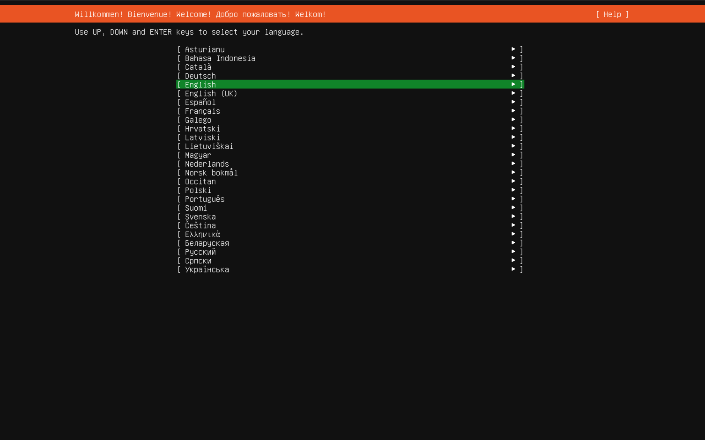

2. Choose your keyboard layout
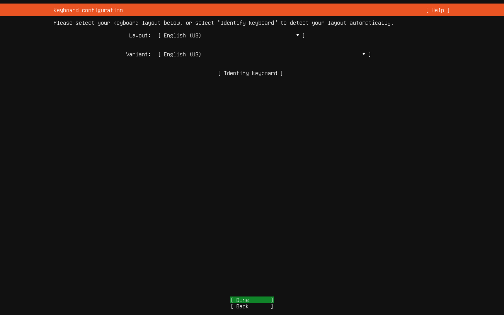

3. Network Configuration, please keep it DHCP
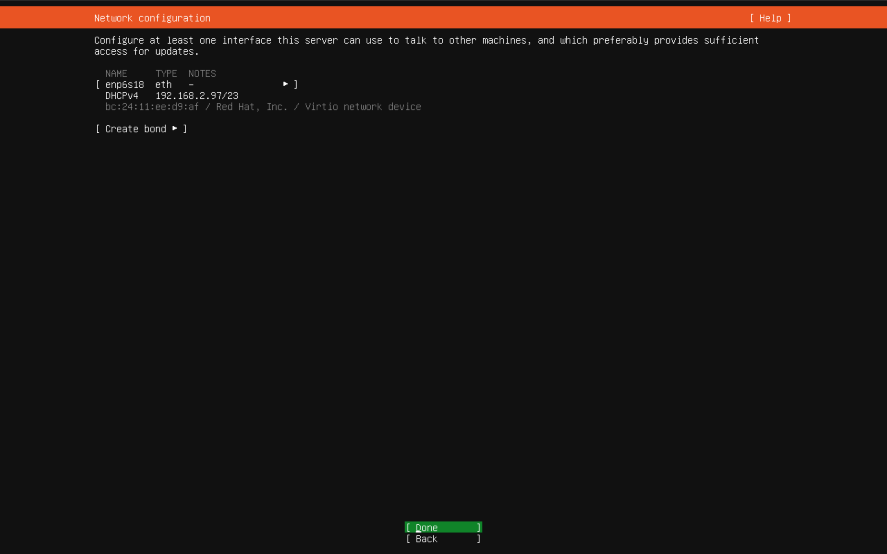

{}
Now, you could go to your router's DHCP settings, find and add your VM's LAN IP address to DHCP reservation, if you want, you could also assign other IP address.
{}

4. It should choose mirror automatically, if yes, next
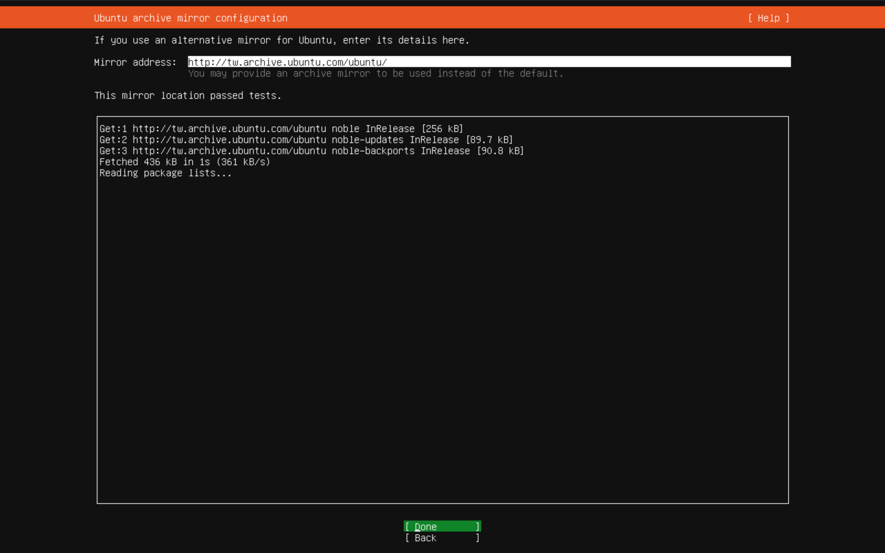

5. Choose minimized to reduce memory and disk usage
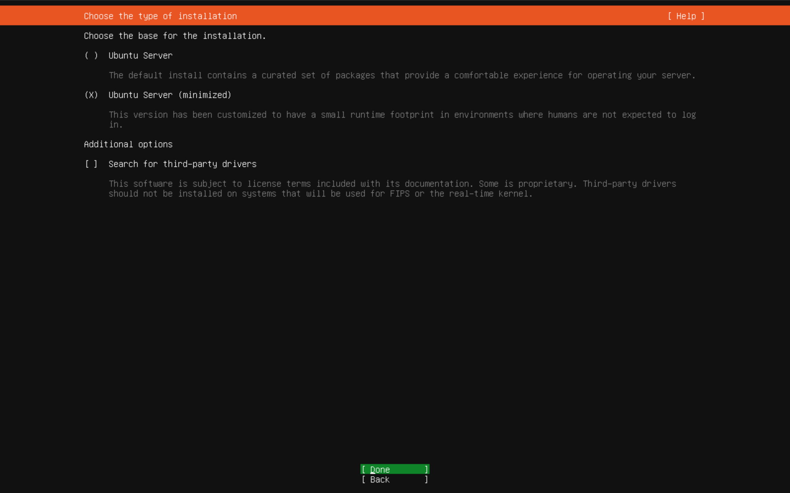

6. Use entire disk
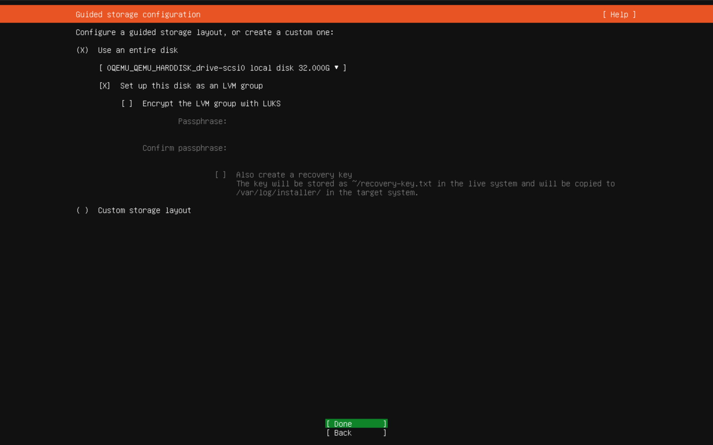

7. Confirm your disk options
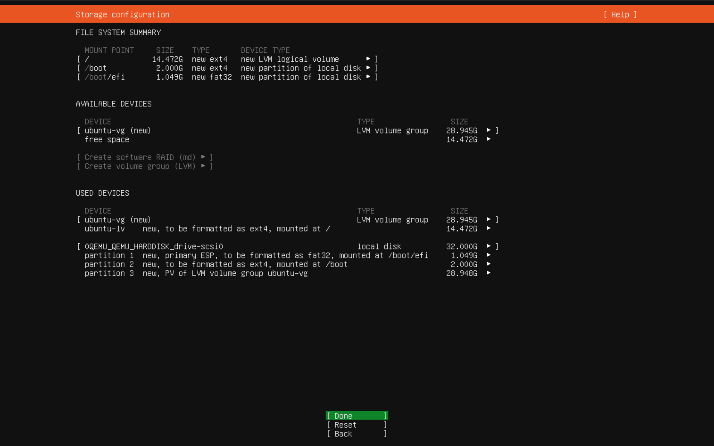

8. Set your server name, username, and password
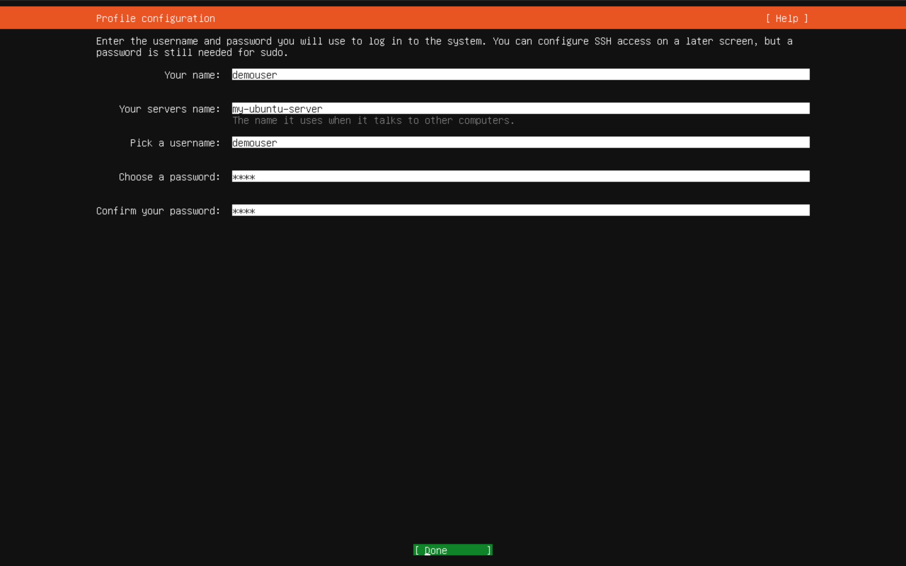

9. Skip [Ubuntu Pro](https://ubuntu.com/pro) register, or you could do it right now
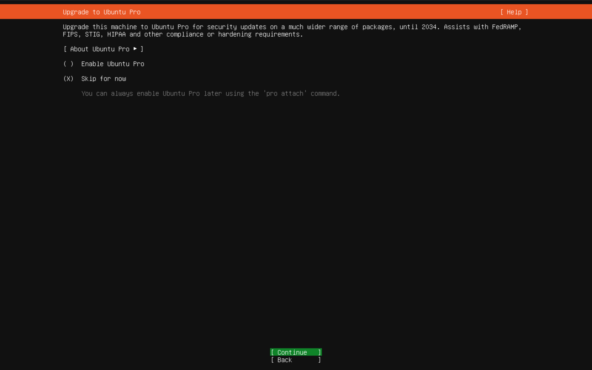

10. We need to install OpenSSH
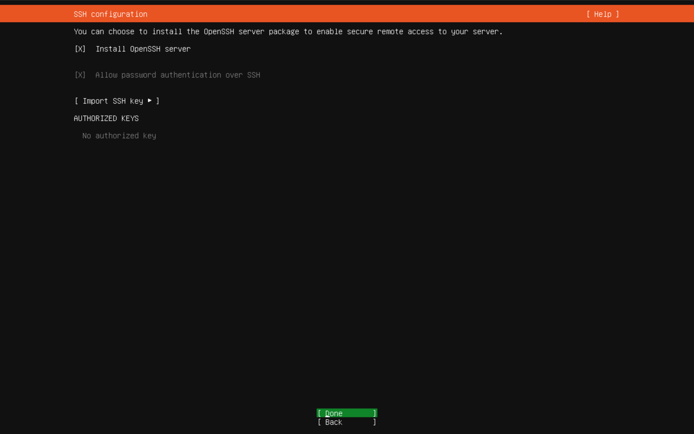

11. Skip anything at this page, because it is snap package
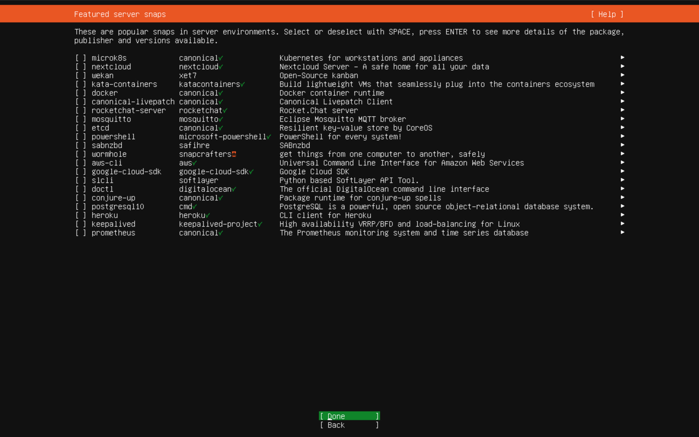

12. After installed it may doing auto update, you could let it update, after it done, reboot.

### 2. Setup Server

1. Open VSCode, click button at left corner and select SSH
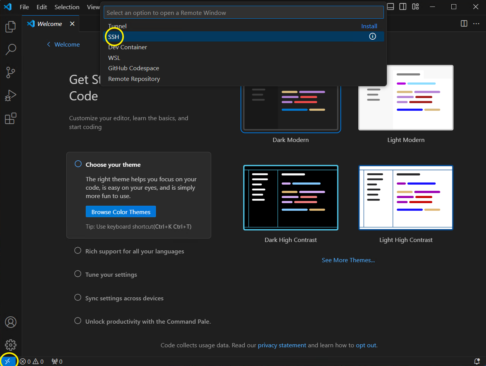

2. Enter `username@IP`, for example `demouser@192.168.2.98`, and then `Enter`
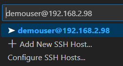

3. Select your system `Linux`

4. Confirm the fingerprint of the server

5. Enter the password of your user

6. Open your home folder
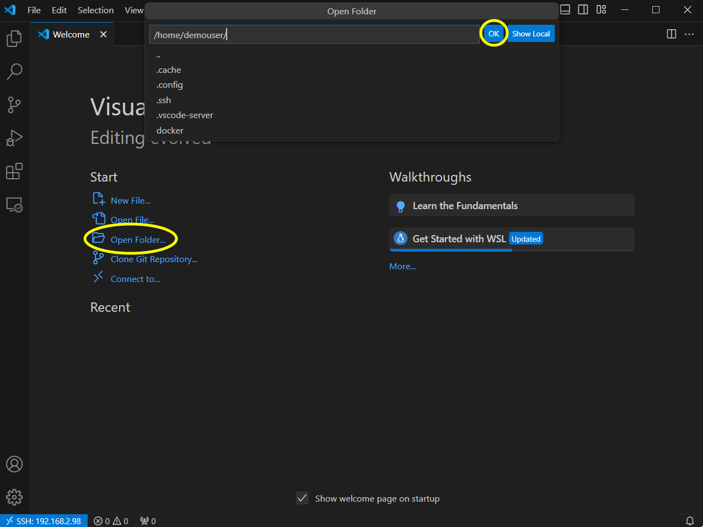

7. Click `Yes, I trust the authors`

8. Open terminal
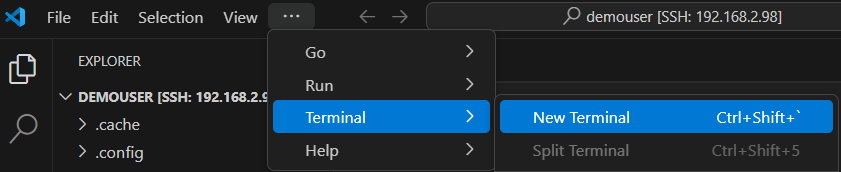

9. Install packages
```
sudo apt install docker.io docker-compose python3-pip curl git vim nano zram-config -y
```

10. Disable disk swap

Check if swap file exists
```
sudo vim /etc/fstab
```

If you find anything similar to:
```
/swap.img       none    swap    sw      0       0
```
If not: Type `:qa!` then `Enter` to exit. And skip to step 11

If yes: Press `i` to activate edit mode, comment that line with `#` like this:
```
#/swap.img       none    swap    sw      0       0
```
Press `Esc` and type `:wq` then `Enter` to save the changes.

11. Adjust ZRAM size

ZRAM means "compress ram", it is more efficient and won't occupy disk space.

```
sudo vim /usr/bin/init-zram-swapping
```

Find the line with
```
mem=$((totalmem / 2 * 1024))
```

And adjust it to:
```
mem=$((totalmem * 2 * 1024))
```
Save and exit

12. Set your timezone

Find your timezone at [Wikipedia](https://en.wikipedia.org/wiki/List_of_tz_database_time_zones)

```
sudo timedatectl set-timezone "Asia/Taipei"
```

13.  Reboot
```
sudo reboot
```
After reboot, reconnect with your VSCode and open terminal.

14. Delete `swap.img`

(Skip if you don't have it.)

We've replaced swap file with ZRAM, now we can delete `swap.img` now, replace `swap.img` with others if your name is different.
```
sudo rm /swap.img
```

### 3. Setup RustDesk Server

1. Run this command to create required folders once:
```
cd ~ && mkdir -p docker/rustdesk-server/data
```

2. Create `compose.yml`

Right click `rustdesk-server` folder, create new file named `compose.yml`.

Paste this to `compose.yml`.

After you copied, you should replace `rustdesk.example.com` (Which point to your `hbbr`) to the domain that will point to your server.

{}
You could modify the line with `hbbs` to your server's LAN IP  temporarily (If you're deploying in your LAN) to ensure it is working. After you verify your server is working, you **should** change back.
{}

{}
Having problem after you changed LAN IP to domain? You should check [this article](/docs/en/self-host/nat-loopback-issues/).
{}

```yaml
services:
  hbbs:
    container_name: hbbs
    image: rustdesk/rustdesk-server:latest
    command: hbbs -r rustdesk.example.com:21117
    volumes:
      - ./data:/root
    network_mode: host
    depends_on:
      - hbbr
    restart: always

  hbbr:
    container_name: hbbr
    image: rustdesk/rustdesk-server:latest
    command: hbbr
    volumes:
      - ./data:/root
    network_mode: host
    restart: always

# Because using docker host mode
# Just in case you forgot the ports:
# 21114 TCP for web console, only available in Pro version
# 21115 TCP for NAT type test
# 21116 TCP TCP hole punching
# 21116 UDP heartbeat/ID server
# 21117 TCP relay
# 21118/21119 TCP for web socket if you want to run web client
```
Check [here](/docs/en/client) to set up your client. Only `ID server` and `Key` is needed. `Relay server` isn't needed because we've set it in `hbbs`, hbbs will provide this information automatically.

3. Start the server
```
cd ~/docker/rustdesk-server
sudo docker-compose up -d
```

4. Check it is working

In your VSCode, you should see `id_ed25519`, `id_ed25519.pub` on your `docker/rustdesk-server/data` folder. You could click `id_ed25519.pub`, this is the public key that you need for your RustDesk client.

The public key will looks like this:
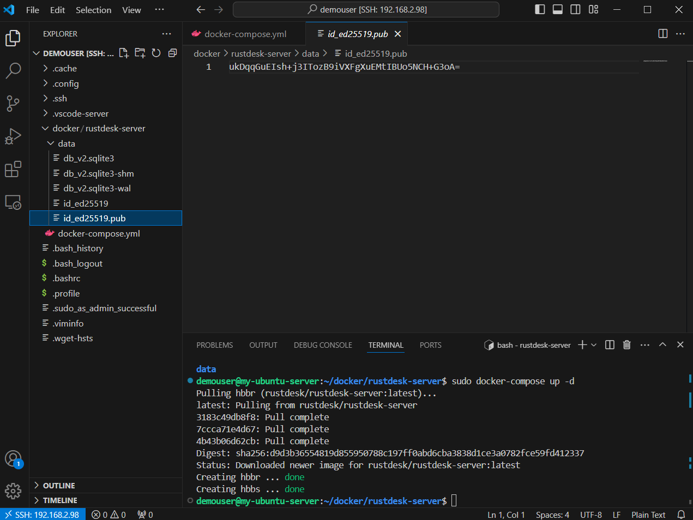

### 4. Set port forwarding on your router/VPS

Go to your router's admin webpage, find anything related to `Port forwarding`, it should appear in `WAN` or `Firewall` settings.

If you still can't find the setting, Google search `{Router brand} + port forwarding` or `{Router model} + port forwarding`. If this device is from your ISP, ask them.

If you're using VPS, Google search `{VPS vendor name} + firewall port` to find the specific procedure for your VPS.

Open these required ports:
  * `21114` TCP for web console, only available in Pro version
  * `21115` TCP for NAT type test
  * `21116` TCP TCP hole punching
  * `21116` UDP heartbeat/ID server
  * `21117` TCP relay
  * `21118/21119` TCP for web socket if you want to run web client

### 5. Some basics

1. How to apply the settings after you modified `compose.yml`?

Run this again:
```
sudo docker-compose up -d
```

2. How to stop and delete the container?

(This won't clear your data)
```
sudo docker-compose down
```

3. How to backup the server?

First, run `sudo docker-compose down`, than download it.
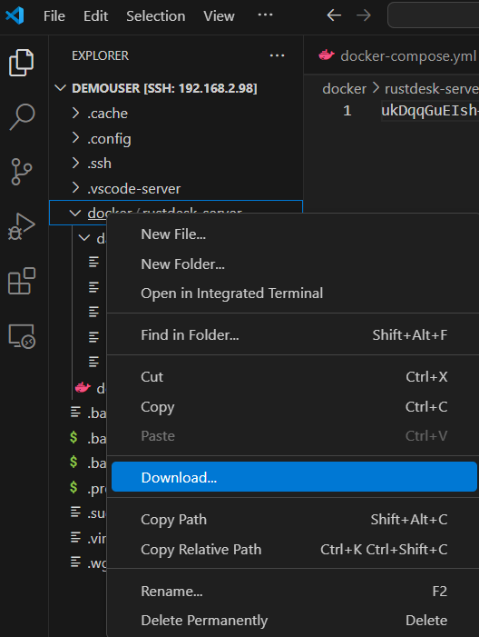

Drag and drop them to VSCode Explorer if you want to upload it.

4. How to update the container automatically?

Use [Watchtower](https://containrrr.dev/watchtower/).

Create folder and put the `compose.yml` in it.

```
mkdir ~/docker/watchtower
```
Change your timezone with yours at `TZ`.

If you didn't specify any container name, it will update **all** of your containers.

At the following command, it will run everyday at 3 AM, for more details, check their [documentation](https://containrrr.dev/watchtower/arguments/#scheduling).

```yaml
version: "3"
services:
  watchtower:
    image: containrrr/watchtower:latest
    container_name: watchtower
    network_mode: bridge
    volumes:
      - /var/run/docker.sock:/var/run/docker.sock
    environment:
      TZ: Asia/Taipei
    command: --cleanup --schedule "0 0 3 * * *" hbbr hbbs
    restart: always
```

5. How to update Ubuntu system automatically?

By default, Ubuntu will installing security updates automatically, Google search: `ubuntu unattended-upgrades` or check the file at `/etc/apt/apt.conf.d/50unattended-upgrades` for more details.
