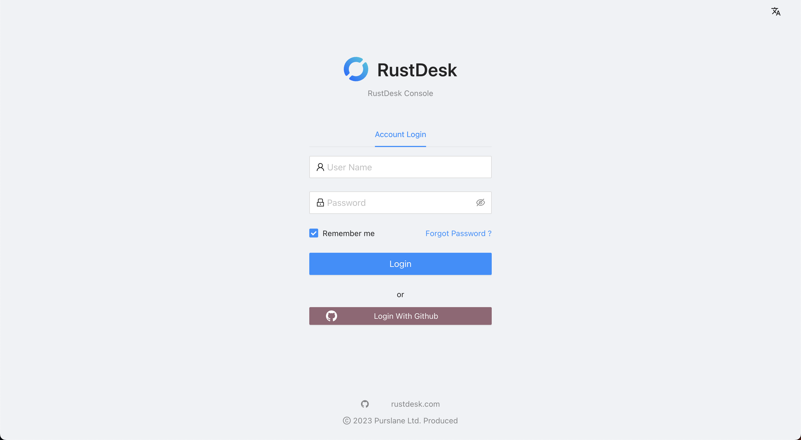

功能：

- 新增/变更使用者和使用者群组
- 变更设备存取权限
- 浏览设备访问和其他日志
- 更新设置
- 管理客户端设定同步策略

## 登录

如同之前所述，网页控制台的预设端口为 21114。在浏览器输入 `http://<hbbs host>:21114` 以进入控制台页面。如下图所示 (hbbs 执行在 IP 为 192.168.1.143 的服务器上)：

如果您需要 https，请安装如 `Nginx` 的网页服务器。

预设管理员帐号/密码为 admin/test1234，请记得在登入后变更密码，在右上角的帐号选单选择 "设定" 以进入密码变更页面，如下图所示。您也可以建立另一个管理员帐号，并删除预设帐号，建议启用电子邮件登入验证。

非管理员使用者也可以登入来浏览他们的设备和日志，以及变更他们的使用者设定。

## Windows EXE

对于 Windows 客户端，您可以省略自定义服务器配置，并将配置信息放在`RustDesk.exe`文件名中。 如上图，请进入控制台欢迎页面，点击`Windows EXE`。 **`客户端 >=1.1.9`**。
