Usa questa guida per configurare RustDesk Server Pro in modo da inviare e-mail tramite Microsoft 365 Exchange Online con OAuth2.

Questa configurazione e adatta a e-mail di invito, e-mail di verifica dell'accesso e notifiche di allarme di connessione.

Per la configurazione SMTP generale, vedi [SMTP](../).

## Quali Valori Inserire in RustDesk Pro?

| Campo RustDesk Pro | Valore da inserire |
| --- | --- |
| From | L'indirizzo mittente mostrato nei messaggi in uscita. |
| Mail Account | L'indirizzo della mailbox che RustDesk usa come nome utente XOAUTH2 SMTP. |
| OAuth2 Tenant ID | `Directory (tenant) ID` nella panoramica dell'app |
| OAuth2 Client ID | `Application (client) ID` nella panoramica dell'app |
| OAuth2 Client secret | Il `Value` del secret creato in `Certificates & secrets` |

Questa schermata mostra dove inserire questi valori in RustDesk:
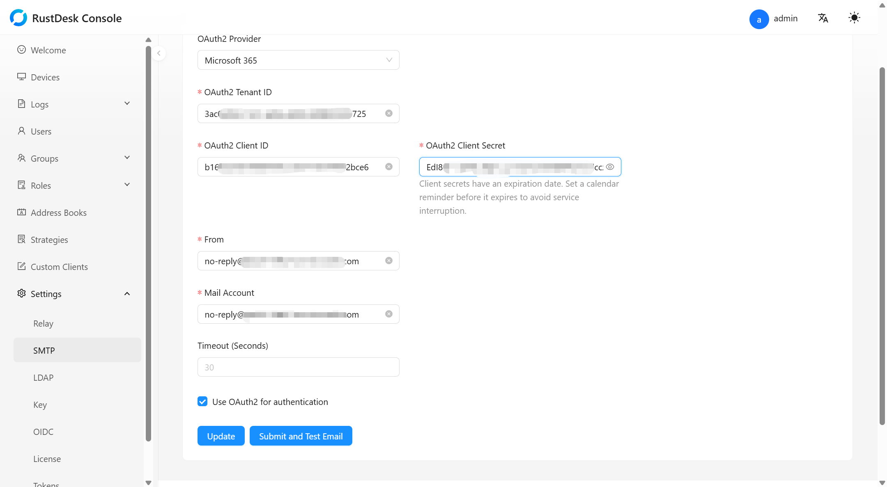

## Configurazione

Prima di iniziare questa configurazione, assicurati di avere:

- RustDesk Server Pro `1.8.1` o successivo
- Una mailbox Microsoft 365 esistente, oppure una mailbox che prevedi di creare per l'invio, ad esempio `no-reply@contoso.com`
- Un account amministratore Microsoft 365 che possa concedere l'admin consent in Microsoft Entra e gestire i service principal di Exchange Online

Questa configurazione ha tre parti:

- Configurare in Azure la registrazione dell'app, il client secret, il permesso API e l'admin consent
- Configurare in PowerShell il service principal di Exchange Online, la mailbox e i permessi
- Configurare SMTP OAuth2 in RustDesk e inviare una e-mail di test

### 1. Configurare in Azure

1. Accedi al [portale di Azure](https://portal.azure.com).
1. Cerca e seleziona **App registrations**.
1. Nel menu a sinistra, seleziona [**App registrations**](https://portal.azure.com/#view/Microsoft_AAD_IAM/ActiveDirectoryMenuBlade/~/RegisteredApps), quindi fai clic su **New registration**.
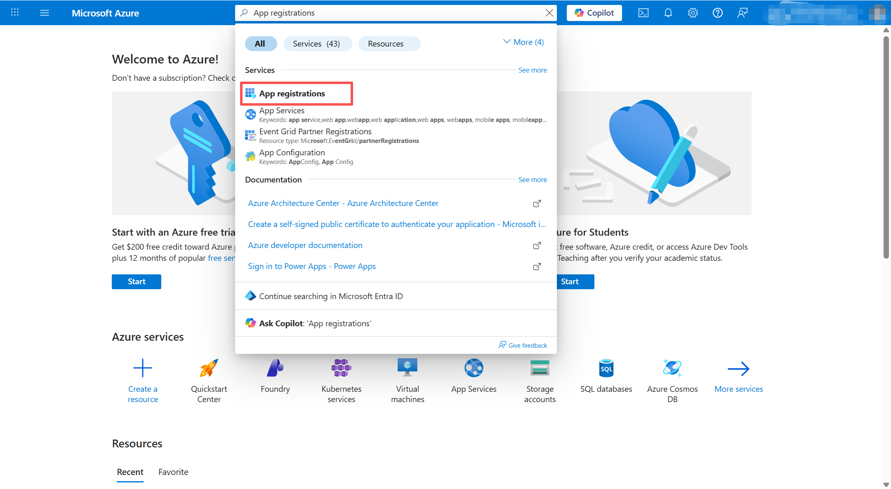
1. Crea la registrazione dell'app.
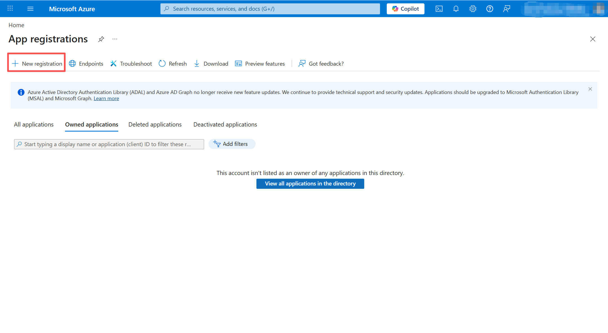
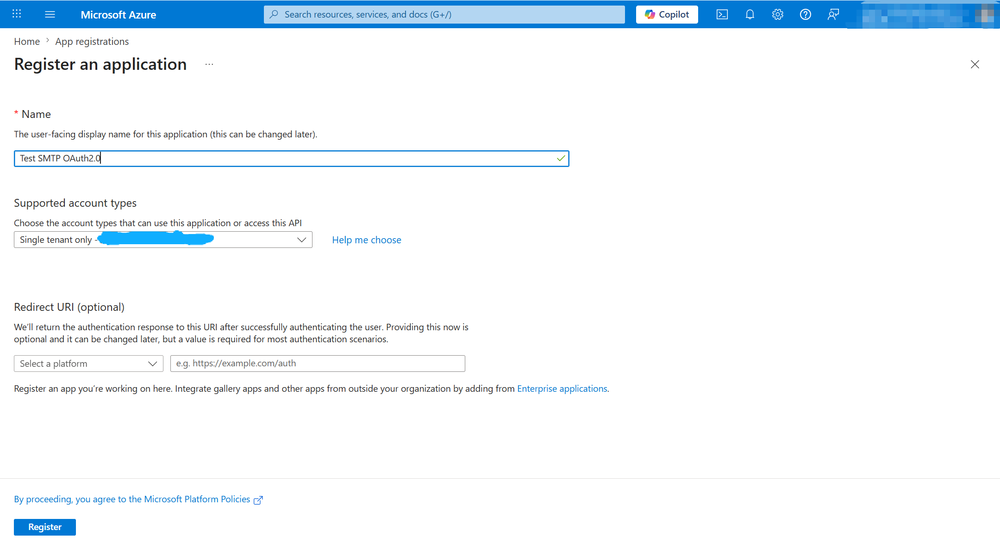
1. Annota `Directory (tenant) ID` e `Application (client) ID`. Li inserirai piu tardi in RustDesk.
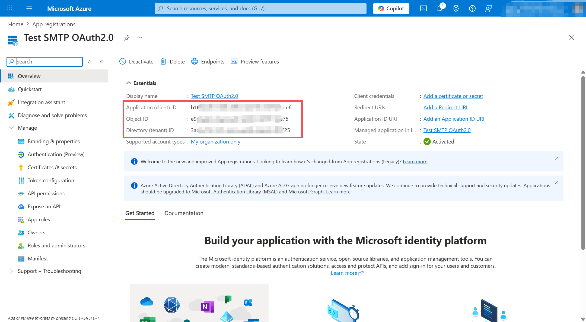
1. Apri **Certificates & secrets** e crea un nuovo client secret.
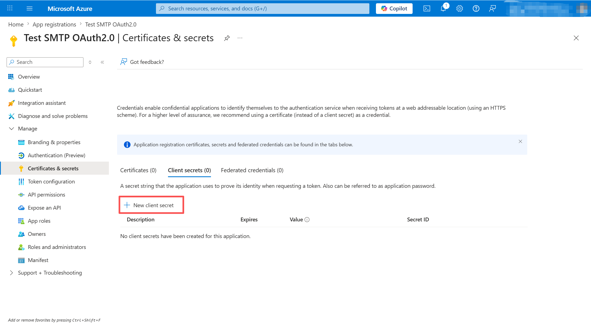
1. Copia subito il `Value` del secret. Microsoft mostra questo valore una sola volta.
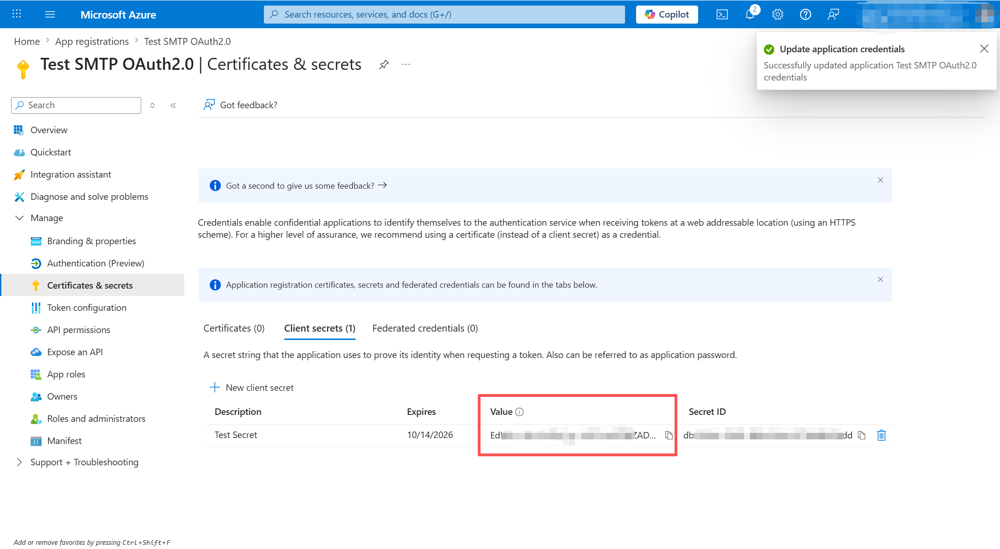
1. Apri **API permissions** e aggiungi il permesso applicativo SMTP di Microsoft 365 Exchange Online.
1. Seleziona **Add a permission**.
1. Seleziona **APIs my organization uses** e cerca **Office 365 Exchange Online**.
1. Seleziona **Application permissions**.
1. Seleziona **SMTP.SendAsApp** e salva la modifica.
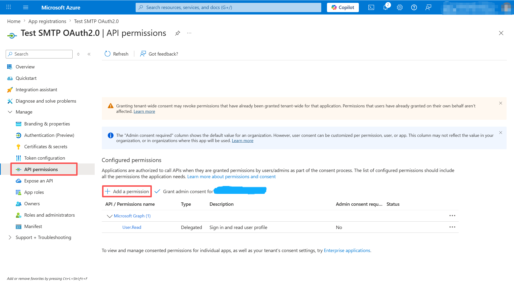
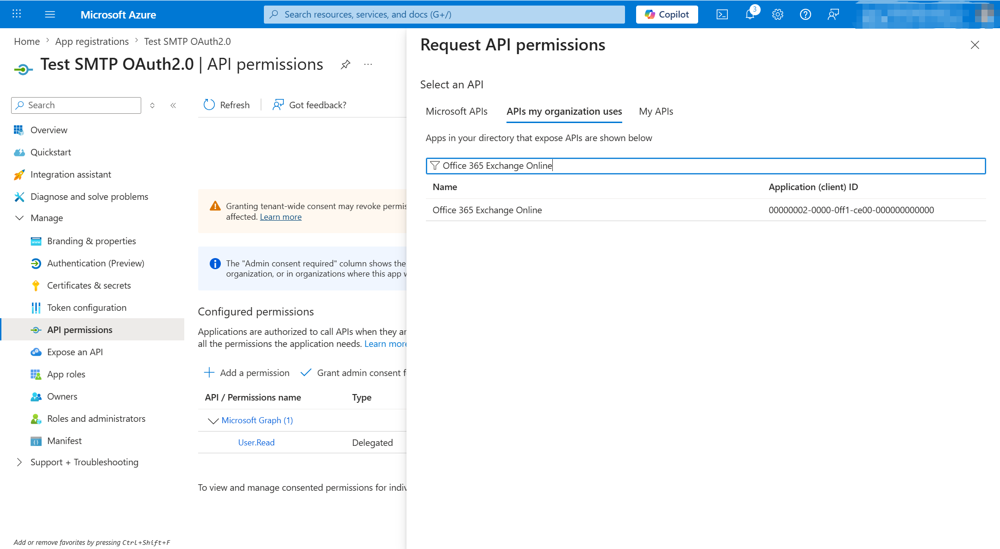
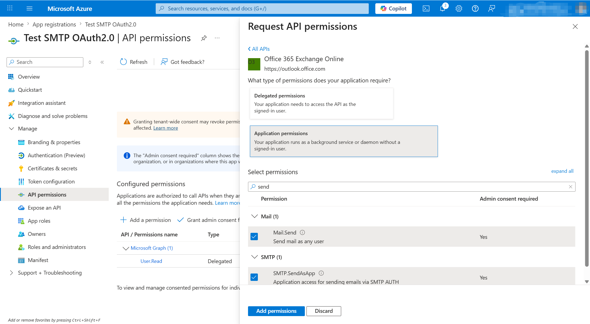
1. Concedi l'admin consent per il permesso appena aggiunto.
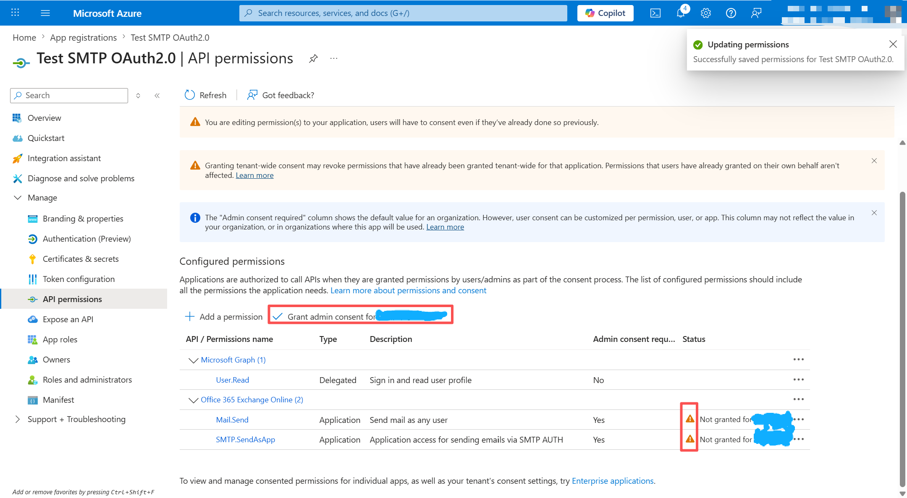
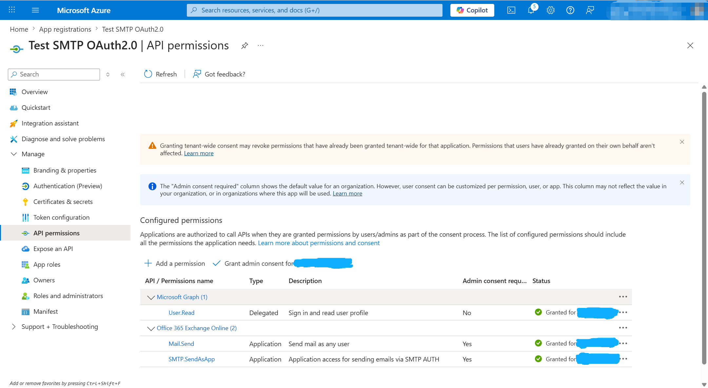

### 2. Configurare in PowerShell

In questa parte ti connetti a Exchange Online, crei il service principal, prepari la mailbox e concedi i permessi.

1. Apri PowerShell come amministratore locale.
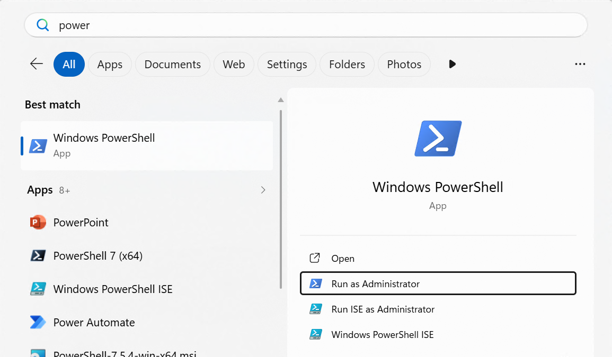
1. Installa il modulo Exchange Online e connettiti con l'account amministratore del tenant.

```powershell
Install-Module -Name ExchangeOnlineManagement
Import-Module ExchangeOnlineManagement
Connect-ExchangeOnline
```

Se vuoi specificare esplicitamente l'account amministratore, puoi anche usare:

```powershell
Connect-ExchangeOnline -UserPrincipalName admin@contoso.com
```

1. In Microsoft Entra **Enterprise applications**, trova l'app e annota il suo `Object ID`. Ti servira quando creerai il service principal di Exchange Online.

{}
L'`OBJECT_ID` qui deve essere l'object ID dell'app in **Enterprise applications**, non l'object ID mostrato nella panoramica di **App registrations**.
{}

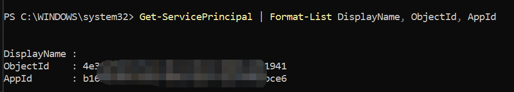

1. Esegui questo comando per creare il service principal di Exchange Online per la registrazione dell'app. La documentazione Microsoft descrive questo passaggio come la registrazione del service principal di un'applicazione Microsoft Entra in Exchange Online.

```powershell
New-ServicePrincipal -AppId <APPLICATION_ID> -ObjectId <OBJECT_ID>
```

Se questo comando fallisce anche se la connessione a Exchange e riuscita, verifica che l'account amministratore abbia il permesso di gestire i service principal di Exchange Online.
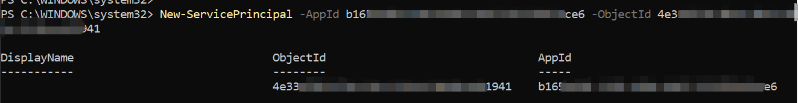

1. Conferma che Exchange abbia creato il service principal e annota il suo valore `Identity` per i passaggi successivi.

```powershell
Get-ServicePrincipal | Format-Table DisplayName,AppId,ObjectId,Identity
```

Usa il valore `Identity` restituito qui come `<SERVICE_PRINCIPAL_ID>` nei due comandi di autorizzazione successivi.

1. Se la mailbox di invio non esiste ancora, puoi prima creare una shared mailbox, ad esempio:

```powershell
New-Mailbox -Shared -Name "No Reply" -Alias no-reply -DisplayName "No Reply" -PrimarySmtpAddress no-reply@contoso.com
```

Se hai gia una mailbox per l'invio, puoi saltare questo passaggio.
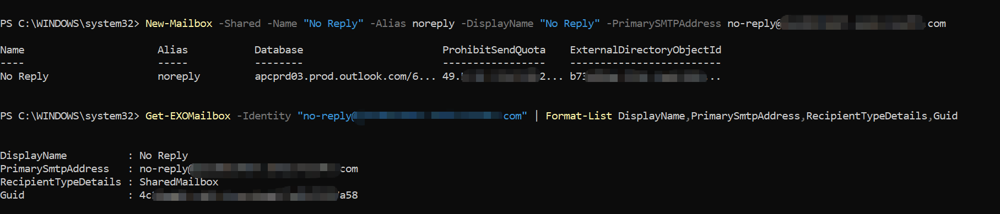

1. Controlla se `Authenticated SMTP` e abilitato per il tenant e per la mailbox di invio.

```powershell
Get-TransportConfig | Format-List SmtpClientAuthenticationDisabled
Get-CASMailbox -Identity "no-reply@contoso.com" | Format-List SmtpClientAuthenticationDisabled
```

Se non e abilitato, le e-mail di test possono fallire con questo errore:

```text
permanent error (535): 5.7.139 Authentication unsuccessful, SmtpClientAuthentication is disabled for the Tenant. Visit https://aka.ms/smtp_auth_disabled for more information.
```

Per l'impostazione a livello di mailbox, esegui questo comando se necessario:

```powershell
Set-CASMailbox -Identity "no-reply@contoso.com" -SmtpClientAuthenticationDisabled $false
```

Se l'impostazione a livello di tenant restituisce `True`, decidi in base alla policy della tua organizzazione se eseguire:

```powershell
Set-TransportConfig -SmtpClientAuthenticationDisabled $false
```

Se le impostazioni del tenant e della mailbox sembrano corrette ma lo stesso errore `535 5.7.139` continua a comparire, controlla anche se il tenant usa Microsoft Entra `Security defaults`. Microsoft Learn indica che SMTP AUTH e disabilitato in Exchange Online quando `Security defaults` e abilitato.

Per i dettagli dei comandi, vedi Microsoft Learn: [Enable or disable authenticated client SMTP submission (SMTP AUTH) in Exchange Online](https://learn.microsoft.com/en-us/Exchange/clients-and-mobile-in-exchange-online/authenticated-client-smtp-submission).

1. Concedi al service principal di Exchange `FullAccess` alla mailbox che RustDesk usera per inviare posta.

```powershell
Add-MailboxPermission -Identity "no-reply@contoso.com" -User <SERVICE_PRINCIPAL_ID> -AccessRights FullAccess
```

Usa qui la mailbox che prevedi di inserire in `Mail Account` in RustDesk.

Se questo comando restituisce un errore come questo:

```text
Write-ErrorMessage : ||The operation couldn't be performed because object 'no-reply@xxx.com' couldn't be found on 'xxx.xxx.PROD.OUTLOOK.COM'.
```

significa che il valore passato a `-Identity` non e stato risolto in un vero oggetto mailbox in Exchange Online.

Per prima cosa verifica che la mailbox esista davvero in Exchange Online:

```powershell
Get-EXOMailbox -Identity "no-reply@xxx.com" | Format-List DisplayName,PrimarySmtpAddress,RecipientTypeDetails
```

Se non viene restituita alcuna mailbox, crea o conferma prima quella mailbox. Per un indirizzo mittente `no-reply`, puoi creare una shared mailbox, ad esempio:

```powershell
New-Mailbox -Shared -Name "No Reply" -Alias no-reply -DisplayName "No Reply" -PrimarySmtpAddress no-reply@xxx.com
```

Se la mailbox esiste gia, assicurati che il valore usato in `Add-MailboxPermission -Identity ...` sia l'indirizzo reale della mailbox, il suo alias oppure un'altra mailbox identity che Exchange possa risolvere.
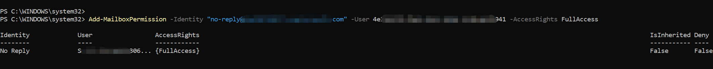

1. Concedi allo stesso service principal anche il permesso `SendAs`.

```powershell
Add-RecipientPermission -Identity "no-reply@contoso.com" -Trustee <SERVICE_PRINCIPAL_ID> -AccessRights SendAs -Confirm:$false
```

Anche questo passaggio fa parte della configurazione SMTP app-only ufficiale di Microsoft.

### 3. Configurare in RustDesk

A questo punto dovresti gia avere:

- l'indirizzo mittente da usare in `From`
- l'indirizzo della mailbox da usare in `Mail Account`
- il `Directory (tenant) ID`
- l'`Application (client) ID`
- il `Value` del client secret
- un service principal di Exchange Online confermato che abbia gia `FullAccess` e `SendAs` sulla mailbox usata in `Mail Account`

RustDesk non richiede l'`Identity` del service principal di Exchange, ma i passaggi di autorizzazione sopra devono essere gia completati prima di testare l'invio.

1. Nella [console web](../../console/) di RustDesk, vai in **Settings** -> **SMTP**.
1. Abilita OAuth2 e seleziona **Microsoft 365** come provider.
1. Compila questi campi:

   - `From`
   - `Mail Account`
   - `OAuth2 Tenant ID`
   - `OAuth2 Client ID`
   - `OAuth2 Client secret`

1. Fai clic su **Check** per salvare la configurazione e inviare una e-mail di test.
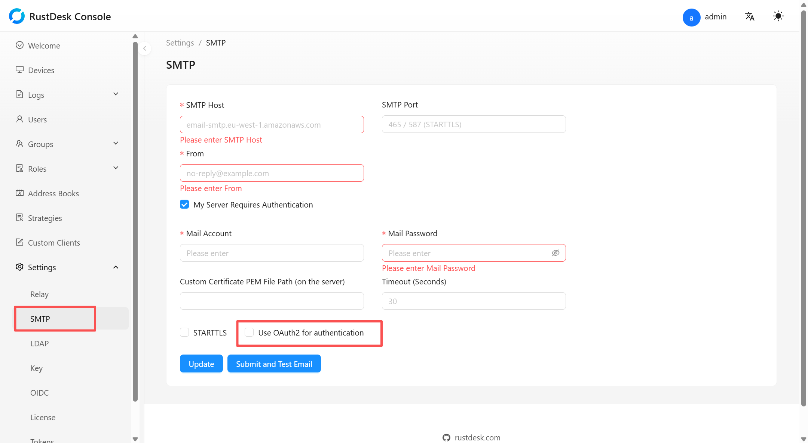


Se la e-mail di test continua a fallire, torna alla sezione PowerShell e ricontrolla il service principal di Exchange Online, `Authenticated SMTP` e i permessi della mailbox usata in `Mail Account`.

## Riferimenti

- Microsoft Learn: [Authenticate an IMAP, POP or SMTP connection using OAuth](https://learn.microsoft.com/en-us/exchange/client-developer/legacy-protocols/how-to-authenticate-an-imap-pop-smtp-application-by-using-oauth). Usato per i passaggi relativi ai permessi applicativi Exchange Online e ai service principal.
- Microsoft Learn: [Enable or disable authenticated client SMTP submission (SMTP AUTH) in Exchange Online](https://learn.microsoft.com/en-us/Exchange/clients-and-mobile-in-exchange-online/authenticated-client-smtp-submission). Usato per controllare e abilitare `Authenticated SMTP`.
- Microsoft Learn: [Create shared mailboxes in the Exchange admin center](https://learn.microsoft.com/en-us/exchange/collaboration/shared-mailboxes/create-shared-mailboxes). Usato per creare una shared mailbox.
