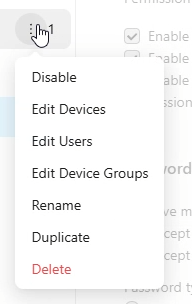
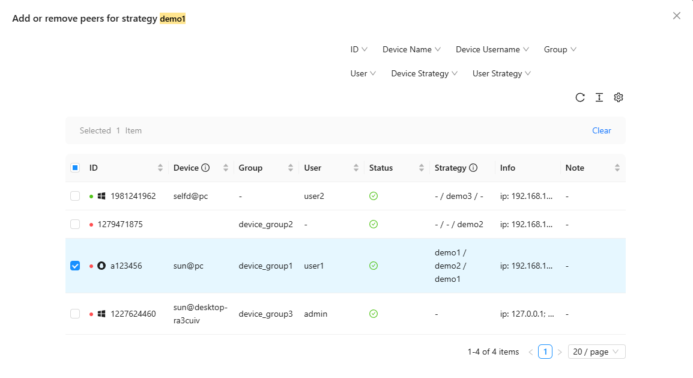
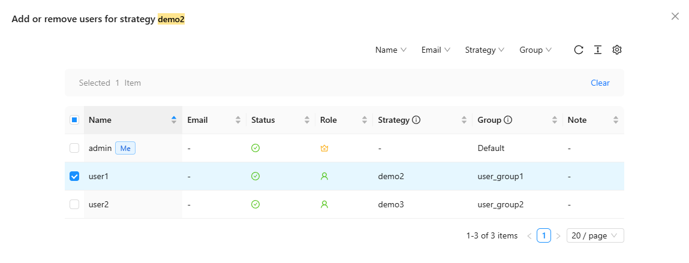

## Strategy

Strategy is a tool for RustDesk administrators to update the security options of client settings pages in bulk. Administrators can create different strategies and apply them to different devices.

### Create Strategies

You can create a new strategy by clicking the `+` button and perform various actions on the strategy by hovering over it and clicking the menu.

In the pop-up menu, you can choose to `Enable` or `Disable` the strategy, `Rename`, `Duplicate`, or `Delete` it. Additionally, you can click `Edit Devices` to modify the devices applied to that strategy or click `Edit Users` to modify the users applied to that strategy.

On the right side of the strategy menu, you can see the number of devices actually applied to the strategy, taking into account the priority of the strategy.

### Device Strategy and User Strategy
Each device can only be managed by one strategy, and device strategies take priority over user strategies. User strategies are responsible for managing all devices under the user that are not assigned a specific strategy.

### Edit Devices

When you click the `Edit Devices` menu, an editing dialog box displaying all the devices will open. You can change the selection status of the checkboxes and then click the `Save` button to apply the device changes made on the current page. If you need to modify devices on other pages, please navigate to those pages. You can also use the dropdown menu in the upper right corner to filter devices.

Here is an example of the dialog box that appears when you click `Edit Devices` on the "demo2" menu. In this example, the device "362587269" is applied to the "demo2" strategy. The device "157333666" was originally applied to the default strategy but will be applied to the "demo2" strategy after clicking `Save`. The device "232026634" has a device strategy for "demo1" and a user strategy for "demo2", since the device strategy takes priority, this device will be applied to the "demo1" strategy.

### Edit Users

When you click the `Edit Users` menu, an editing dialog box  displaying all the users will open. You can change the selection status of the checkboxes and then click the `Save` button to apply the user changes made on the current page. If you need to modify users on other pages, please navigate to those pages. You can also use the dropdown menu in the upper right corner to filter users.

Here is an example of the dialog box that appears when you click `Edit Users` on the "demo2" menu. In this example, the user "user2" was originally applied to the default strategy and will be applied to the "demo2" strategy after clicking `Save`. The user "user1" is applied to the default strategy, and the user "admin" is applied to the "demo2" strategy.

### Strategy Synchronization

Each device can only be managed by one strategy, and if that strategy is disabled, the device will not be managed by any strategy. When synchronizing strategies, RustDesk records the local and server strategy timestamps to determine whether synchronization is necessary. That is, after strategy synchronization is complete:

* If the user changes some options, the client will use the user's options.
* If the administrator changes the strategy content, the client's options will be synchronized.
* If the administrator changes the strategy to which the device belongs, the client's options will be synchronized.

### Edit Strategies

At the bottom of the strategy, click `Edit`, make modifications and click `Submit`. The strategy will be synchronized to devices within 30 seconds.
